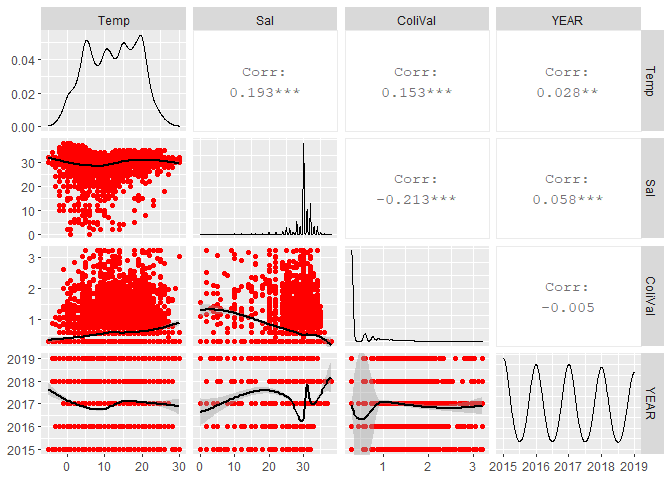
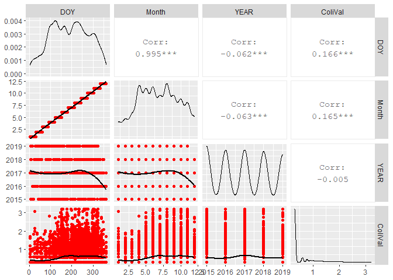

Exploratory Data Analysis of Shellfish Sanitation Program Data
================
Curtis C. Bohlen, Casco Bay Estuary Partnership.
11/14/2020

  - [Load Libraries](#load-libraries)
  - [Load Data](#load-data)
      - [Folder References](#folder-references)
      - [Read Data](#read-data)
      - [Convert to Factors](#convert-to-factors)
  - [Exploratory Data Analysis](#exploratory-data-analysis)
  - [Statistical Considerations](#statistical-considerations)
      - [Why are we doing this analysis
        anyway?](#why-are-we-doing-this-analysis-anyway)
      - [Growing Area Classification
        Standards](#growing-area-classification-standards)
      - [Evaluation](#evaluation)


# Load Libraries

``` r
library(readr)
library(tidyverse)
```

    ## -- Attaching packages ----------------------------------------------------------------------------------- tidyverse 1.3.0 --

    ## v ggplot2 3.3.2     v dplyr   1.0.2
    ## v tibble  3.0.3     v stringr 1.4.0
    ## v tidyr   1.1.2     v forcats 0.5.0
    ## v purrr   0.3.4

    ## -- Conflicts -------------------------------------------------------------------------------------- tidyverse_conflicts() --
    ## x dplyr::filter() masks stats::filter()
    ## x dplyr::lag()    masks stats::lag()

``` r
library(corrr)  # Used for correlate(), which produces a dataframe
```

    ## Warning: package 'corrr' was built under R version 4.0.3

``` r
library(GGally)
```

    ## Registered S3 method overwritten by 'GGally':
    ##   method from   
    ##   +.gg   ggplot2

# Load Data

## Folder References

``` r
sibfldnm <- 'Derived_Data'
parent <- dirname(getwd())
sibling <- file.path(parent,sibfldnm)
fn = 'Shellfish data 2015 2018.csv'
path <- file.path(sibling, fn)
```

## Read Data

``` r
coli_data <- read_csv(path)
```

    ## Parsed with column specification:
    ## cols(
    ##   SDate = col_date(format = ""),
    ##   STime = col_time(format = ""),
    ##   SDateTime = col_datetime(format = ""),
    ##   Station = col_character(),
    ##   GROW_AREA = col_character(),
    ##   OpenClosed = col_character(),
    ##   WDIR = col_character(),
    ##   Tide = col_character(),
    ##   Class = col_character(),
    ##   CATEGORY = col_character(),
    ##   Temp = col_double(),
    ##   Sal = col_double(),
    ##   ColiScore = col_double(),
    ##   RawColi = col_character(),
    ##   YEAR = col_double(),
    ##   LCFlag = col_logical(),
    ##   RCFlag = col_logical(),
    ##   ColiVal = col_double()
    ## )

## Convert to Factors

``` r
coli_data <- coli_data %>%
  mutate_at(4:8, factor) %>%
  mutate(Class = factor(Class,levels = c( 'A', 'CA', 'CR',
                                         'R', 'P', 'X' ))) %>%
  mutate(Tide = factor(Tide, levels = c("L", "LF", "F", "HF",
                                        "H", "HE", "E", "LE"))) %>%
  mutate(DOY = as.numeric(format(SDate, format = '%j')),
         Month = as.numeric(format(SDate, format = '%m')))
```

# Exploratory Data Analysis

``` r
coli_data %>% 
  select(Temp, Sal, ColiVal, YEAR) %>%
  correlate(method = 'spearman')
```

    ## 
    ## Correlation method: 'spearman'
    ## Missing treated using: 'pairwise.complete.obs'

    ## # A tibble: 4 x 5
    ##   rowname    Temp     Sal ColiVal    YEAR
    ##   <chr>     <dbl>   <dbl>   <dbl>   <dbl>
    ## 1 Temp    NA       0.219   0.192   0.0294
    ## 2 Sal      0.219  NA      -0.0801  0.168 
    ## 3 ColiVal  0.192  -0.0801 NA       0.0117
    ## 4 YEAR     0.0294  0.168   0.0117 NA

So, no strong linear correlations. Correlations are slightly higher
using rank correlations.although weak correlations with temperature and
Salinity and salinity and E COli may never the less be meaningful, or
there may be non-linear relationships at play.

``` r
coli_data %>% 
  select(Temp, Sal, ColiVal, YEAR) %>%
  mutate(ColiVal = log10(ColiVal)) %>%
  ggpairs(lower = list(continuous=wrap('smooth_loess', color='red')),
          progress=FALSE)
```

    ## Warning: Removed 829 rows containing non-finite values (stat_density).

    ## Warning in ggally_statistic(data = data, mapping = mapping, na.rm = na.rm, :
    ## Removed 868 rows containing missing values

    ## Warning in ggally_statistic(data = data, mapping = mapping, na.rm = na.rm, :
    ## Removed 849 rows containing missing values

    ## Warning in ggally_statistic(data = data, mapping = mapping, na.rm = na.rm, :
    ## Removed 829 rows containing missing values

    ## Warning: Removed 868 rows containing non-finite values (stat_smooth).

    ## Warning: Removed 868 rows containing missing values (geom_point).

    ## Warning: Removed 707 rows containing non-finite values (stat_density).

    ## Warning in ggally_statistic(data = data, mapping = mapping, na.rm = na.rm, :
    ## Removed 708 rows containing missing values

    ## Warning in ggally_statistic(data = data, mapping = mapping, na.rm = na.rm, :
    ## Removed 707 rows containing missing values

    ## Warning: Removed 849 rows containing non-finite values (stat_smooth).

    ## Warning: Removed 849 rows containing missing values (geom_point).

    ## Warning: Removed 708 rows containing non-finite values (stat_smooth).

    ## Warning: Removed 708 rows containing missing values (geom_point).

    ## Warning: Removed 684 rows containing non-finite values (stat_density).

    ## Warning in ggally_statistic(data = data, mapping = mapping, na.rm = na.rm, :
    ## Removed 684 rows containing missing values

    ## Warning: Removed 829 rows containing non-finite values (stat_smooth).

    ## Warning: Removed 829 rows containing missing values (geom_point).

    ## Warning: Removed 707 rows containing non-finite values (stat_smooth).

    ## Warning: Removed 707 rows containing missing values (geom_point).

    ## Warning: Removed 684 rows containing non-finite values (stat_smooth).

    ## Warning: Removed 684 rows containing missing values (geom_point).

<!-- -->

So, data are very highly scattered, obscuring patterns even when the *E.
coli* counts are log transformed. It appears *E. coli* Levels are weakly
related to salinity and temperature, which are not especially correlated
themselves. The highly skewed *E. coli* data is problematic.

``` r
coli_data %>%
  select(DOY, Month, YEAR, ColiVal) %>%
  mutate(ColiVal = log10(ColiVal)) %>%
  ggpairs(lower = list(continuous=wrap('smooth_loess', color='red')), progress=FALSE) 
```

    ## Warning in ggally_statistic(data = data, mapping = mapping, na.rm = na.rm, :
    ## Removed 684 rows containing missing values
    
    ## Warning in ggally_statistic(data = data, mapping = mapping, na.rm = na.rm, :
    ## Removed 684 rows containing missing values
    
    ## Warning in ggally_statistic(data = data, mapping = mapping, na.rm = na.rm, :
    ## Removed 684 rows containing missing values

    ## Warning: Removed 684 rows containing non-finite values (stat_smooth).

    ## Warning: Removed 684 rows containing missing values (geom_point).

    ## Warning: Removed 684 rows containing non-finite values (stat_smooth).

    ## Warning: Removed 684 rows containing missing values (geom_point).

    ## Warning: Removed 684 rows containing non-finite values (stat_smooth).

    ## Warning: Removed 684 rows containing missing values (geom_point).

    ## Warning: Removed 684 rows containing non-finite values (stat_density).

<!-- -->

No strong patterns with time of year, month, or year, except weak
relationships to time of year. Obvious artifacts due to the discrete
nature of values of the *E. coli* data at low values. Fewer late-year
observations from 2019, so we probably need to either model time of year
or remove 2019 from the data entirely.

# Statistical Considerations

The highly skewed and heavy-tailed nature of the distribution suggests
that any form of linear model or generalized linear model to predict the
observed values will be difficult.

The data is distributed approximately Pareto, so perhaps it could be
modeled with a Pareto GLM (over a fixed support of perhaps 0.5:inf, or
1:inf). The package VGAM supports such Pareto GLMs.

It may be more appropriate to transform observations into exceedences of
one or more thresholds, and analyze the probability of exceedences with
a binomial (multinomial?) or quasi-binomial GLM.

A final alternative may be to use a one-dimensional PERMANOVA to analyze
the observed data. Using euclidean distance metric, this is equivalent
to an ANOVA analysis, but with standard errors and significance levels
driven by permutation tests rather than assumptions of normality. I am
not certain how well that would work with these data’s heavy tails.

If we are willing to forego the modelling sophistication possible with
linear models, we might be able to test for differences in medians by
classes using a rank-based procedure, such as Wilcoxon / Kruskal-Wallis,
etc.

## Why are we doing this analysis anyway?

Selection of methods here hinges on our analytic goals. To some extent,
those goals are unclear, which complicates planning of the analysis.
Results of analysis will end up as one or two graphics in State of the
Bay. The most important graphic will be a map of some sort of levels of
risk or concern. Another graphic could be used to show off interesting
relationships, such has between levels of contamination and time of
year, temperature, or salinity. A third possibility is that results
could be used to create some sort of geospatial analysis looking for
correlations with nearby land use.

In the State of the Bay Report we want to convey certain messages: 1.
Some sites are more likely to have high bacteria counts than others –
and we’d like to show that as a map. 2. We’d like to be able to give
some explanation for some of those differences. 3. We may want to show
relationships to other predictors, including time of year, rainfall,
salinity, temperature, land use etc. 4. We’d like to see whether sites
falling under different classifications have expected differences in
probability of extreme values.

So, our core need is for some sort of summary statistic for individual
sites that we can use to show geographic patterns. The second need is
for models that allow us to explore the impact of both categorical and
quantitative predictors.

Here are the criteris used for establishing shellfish harvest area

## Growing Area Classification Standards

| Growing Area Classification | Activity Allowed                                                          | Geometric mean FC/100ml | 90th Percentile (P90) FC/100ml |
| --------------------------- | ------------------------------------------------------------------------- | ----------------------- | ------------------------------ |
| Approved                    | Harvesting allowed                                                        | ≤ 14                    | ≤ 31                           |
| Conditionally Approved      | Harvesting allowed except during specified conditions                     | ≤ 14 in open status     | ≤ 31 in open status            |
| Restricted                  | Depuration harvesting or relay only                                       | ≤ 88 and \>15           | ≤ 163 and \>31                 |
| Conditionally Restricted    | Depuration harvesting or relay allowed except during specified conditions | ≤ 88 in open status     | ≤ 163 in open status           |
| Prohibited                  | Aquaculture seed production only                                          | \>88                    | \>163                          |

So, critical levels for Geometric Mean include: \(<=14\) and \(<= 88\)
and for the p90 \(< 31\) and \(<= 163\)

## Evaluation

We can readily calculate a geometric mean for each site – which is the
basis on which shellfish area closures are calculated – but we can not
readily model geometric means for this distribution. The most straight
forward way to do that would be to analyze the log of counts, but even
the log of the raw data is highly skewed. I’m not sure if the
log-transformed data is heavy tailed.
