Analysis of Shellfish Pathogen Data
================
Curtis C. Bohlen, Casco Bay Estuary Partnership.
02/17/2021

-   [Introduction](#introduction)
-   [Relevant Standards](#relevant-standards)
    -   [Growing Area Classification
        Standards](#growing-area-classification-standards)
    -   [Maine State Class SB Waters
        Standards](#maine-state-class-sb-waters-standards)
-   [Load Libraries](#load-libraries)
-   [Load Data](#load-data)
    -   [Main Data](#main-data)
        -   [Address Censored Data](#address-censored-data)
        -   [Remove NAs](#remove-nas)
    -   [Weather Data](#weather-data)
    -   [Incorporate Weather Data](#incorporate-weather-data)
    -   [Remove Sites not in Region](#remove-sites-not-in-region)
-   [Preliminary Graphics](#preliminary-graphics)
    -   [Histogram](#histogram)
    -   [Pareto Fit?](#pareto-fit)
    -   [Simple Time Plot](#simple-time-plot)
        -   [Create Geometric Mean
            Function](#create-geometric-mean-function)
        -   [Plot](#plot)
-   [Data Summaries](#data-summaries)
    -   [Summary Statistics Dataframe](#summary-statistics-dataframe)
        -   [Graphic](#graphic)
-   [Modeling](#modeling)
    -   [Simple Log Linear Model](#simple-log-linear-model)
        -   [Graphic](#graphic-1)
    -   [Linear Rainfall Model](#linear-rainfall-model)
        -   [Graphic](#graphic-2)
    -   [Selection of GLM Family](#selection-of-glm-family)
    -   [Simple Gamma GLM](#simple-gamma-glm)
    -   [Inverse Gaussian GLM](#inverse-gaussian-glm)
    -   [Rainfall Gaussian GLM](#rainfall-gaussian-glm)
        -   [Results](#results)
        -   [Graphic](#graphic-4)
    -   [Growing Regions GAM](#growing-regions-gam)
        -   [Plot](#plot-1)
        -   [Graphic](#graphic-5)
    -   [Seasonal Model](#seasonal-model)
        -   [Pairwise Comparisons](#pairwise-comparisons)
        -   [Results](#results-1)
        -   [Graphic](#graphic-6)
    -   [Full Seasonal (DOY) model](#full-seasonal-doy-model)
        -   [Graphic](#graphic-7)
    -   [Pareto Models](#pareto-models)
    -   [Nonparametric Tests](#nonparametric-tests)
        -   [Pairwise Wilcoxon test](#pairwise-wilcoxon-test)
-   [Output Table for GIS](#output-table-for-gis)


# Introduction

Exploratory analysis highlights the extreme skewness of the distribution
of bacteria data, both here with the shellfish -related data collected
by DMR, and with the data related to recreational beaches, collected by
towns, and managed by DEP. Skewness means these data are difficult to
analyze with any authority, and so a degree of humility is called for in
interpreting any analyses.

Our primary goal is to be able to assess if there are important
predictors of elevated bacteria levels that we can discern, and
especially to identify if some sites are unusually vulnerable to
elevated bacteria levels. Here we follow a strategy used in looking at
the Beaches data, of looking at several imperfect modeling strategies to
examine patterns.

Another notebook will directly address modeling of exceedences of
relevant standards. Here we focus on site to site variation, and
relationships to a few covariates.

# Relevant Standards

## Growing Area Classification Standards

| Growing Area Classification | Activity Allowed                                                          | Geometric mean FC/100ml | 90th Percentile (P90) FC/100ml |
|-----------------------------|---------------------------------------------------------------------------|-------------------------|--------------------------------|
| Approved                    | Harvesting allowed                                                        | ≤ 14                    | ≤ 31                           |
| Conditionally Approved      | Harvesting allowed except during specified conditions                     | ≤ 14 in open status     | ≤ 31 in open status            |
| Restricted                  | Depuration harvesting or relay only                                       | ≤ 88 and &gt;15         | ≤ 163 and &gt;31               |
| Conditionally Restricted    | Depuration harvesting or relay allowed except during specified conditions | ≤ 88 in open status     | ≤ 163 in open status           |
| Prohibited                  | Aquaculture seed production only                                          | &gt;88                  | &gt;163                        |

So, critical levels for Geometric Mean include:  &lt;  = 14 and
 &lt;  = 88 and for the p90  &lt; 31 and  &lt;  = 163

## Maine State Class SB Waters Standards

Maine’s water quality criteria includes an additional standard, which
applies only indirectly to these data:  
&gt; the number of enterococcus bacteria in these waters may not exceed
a geometric mean of 8 CFU per 100 milliliters in any 90-day interval or
54 CFU per 100 milliliters in more than 10% of the samples in any 90-day
interval.

38 M.R.S. §465-B(2)(B)

A “90 day interval” might apply to a summer’s worth of data, but in most
years that will only represent a handful of observations at each site.
Also note that this standard is written in terms of “enterococci”, not
“*E. coli* or”colifomes".

# Load Libraries

``` r
library(readr)
library(fitdistrplus)  # For cullen-fray graph etc.
#> Loading required package: MASS
#> Loading required package: survival

library(tidyverse)  # Loads another `select()`
#> -- Attaching packages --------------------------------------- tidyverse 1.3.0 --
#> v ggplot2 3.3.3     v dplyr   1.0.3
#> v tibble  3.0.5     v stringr 1.4.0
#> v tidyr   1.1.2     v forcats 0.5.0
#> v purrr   0.3.4
#> -- Conflicts ------------------------------------------ tidyverse_conflicts() --
#> x dplyr::filter() masks stats::filter()
#> x dplyr::lag()    masks stats::lag()
#> x dplyr::select() masks MASS::select()

library(emmeans)   # For marginal means

library(VGAM)      # For Pareto GLMs and estimation.
#> Loading required package: stats4
#> Loading required package: splines
#> 
#> Attaching package: 'VGAM'
#> The following object is masked from 'package:tidyr':
#> 
#>     fill
library(mgcv)      # For GAMs, here used principally for hierarchical models
#> Loading required package: nlme
#> 
#> Attaching package: 'nlme'
#> The following object is masked from 'package:dplyr':
#> 
#>     collapse
#> This is mgcv 1.8-33. For overview type 'help("mgcv-package")'.
#> 
#> Attaching package: 'mgcv'
#> The following object is masked from 'package:VGAM':
#> 
#>     s

library(CBEPgraphics)
load_cbep_fonts()
theme_set(theme_cbep())

library(LCensMeans)
```

# Load Data

## Main Data

``` r
sibfldnm <- 'Derived_Data'
parent <- dirname(getwd())
sibling <- file.path(parent,sibfldnm)
fl1<- "Shellfish data 2015 2018.csv"
path <- file.path(sibling, fl1)

coli_data <- read_csv(path, 
    col_types = cols(SDate = col_date(format = "%Y-%m-%d"), 
        SDateTime = col_datetime(format = "%Y-%m-%dT%H:%M:%SZ"), # Note Format!
        STime = col_time(format = "%H:%M:%S"))) %>%
  mutate_at(c(4:8), factor) %>%
  mutate(Class = factor(Class, levels = c( 'A', 'CA', 'CR',
                                           'R', 'P', 'X' ))) %>%
  mutate(Tide = factor(Tide, levels = c("L", "LF", "F", "HF",
                                        "H", "HE", "E", "LE"))) %>%
  mutate(DOY = as.numeric(format(SDate, format = '%j')),
         Month = as.numeric(format(SDate, format = '%m'))) %>%
  mutate(Month = factor(Month, levels = 1:12, labels = month.abb))
```

### Address Censored Data

Right censored values are sufficiently rare as to be relatively
unimportant we leave the undressed, but address left censored values.
Interval Censored values add complexity, but are unlikely in our setting
to sharply alter qualitative conclusions, so we chose not to address
them.

We first calculate a estimated conditional mean to replace the (left)
censored values. The algorithm is not entirely appropriate, as it
assumes lognormal distribution, and our data are closer to
Pareto-distributed. Still, it handles the non-detects on a more rational
basis than the usual conventions.

Second, we calculate a version of the data where non-detects are
replaced by half the value of the detection limit. However, we plan to
use the LOG of *E. coli* counts in Gamma GLM models, which require
response variables to be strictly positive. The most common Reporting
Limit in these data is `RL == 2`. Half of that is 1.0, and
`log(1.0) == 0`. Consequently, we replace all values 1.0 with 1.1, as
log(1.1) is positive, and thus can be modeled by a gamm GLM.

As a reminder, `ColiVal` simply includes the censored values at their
reporting limit, providing a third alternative for handling non-detects.

``` r
coli_data <- coli_data %>%
  mutate(ColiVal_ml = sub_cmeans(ColiVal, LCFlag)) %>%
  mutate(ColiVal_hf = if_else(LCFlag, ColiVal/2, ColiVal),
         ColiVal_hf = if_else(ColiVal_hf == 1, 1.1, ColiVal_hf))
```

``` r
ggplot(coli_data, aes(x = ColiVal, y = ColiVal_ml, color = LCFlag)) +
  geom_point() +
  xlim(0,25) +
  ylim(0,25)
#> Warning: Removed 1405 rows containing missing values (geom_point).
```

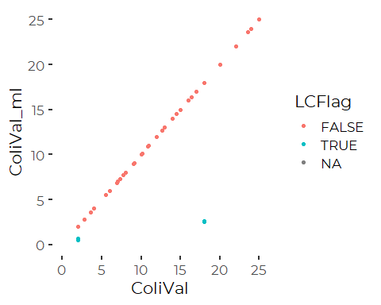

Almost all censored values were at 2

``` r
coli_data %>%
  filter(ColiVal == 2, LCFlag) %>%
  pull(ColiVal_ml) %>%
  summary
#>    Min. 1st Qu.  Median    Mean 3rd Qu.    Max. 
#>  0.5393  0.5997  0.6112  0.6114  0.6226  0.6860
```

So, our (lognormal) based estimator for censored values estimates a
non-detect at somewhere around 0.61 CF per 100 ml. Because data has
substantially heavier tails than a lognormal distribution, that estimate
is probably an overestimate of more realistic conditional expectation.

### Remove NAs

``` r
coli_data <- coli_data %>%
  filter (! is.na(ColiVal))
```

## Weather Data

We simplify the weather data somewhat.

``` r
sibfldnm    <- 'Original_Data'
parent      <- dirname(getwd())
sibling     <- file.path(parent,sibfldnm)

fn <- "Portland_Jetport_2015-2019.csv"
fpath <- file.path(sibling, fn)

weather_data <- read_csv(fpath, 
 col_types = cols(AWNDattr = col_skip(), 
        FMTM = col_skip(), FMTMattr = col_skip(), 
        PGTM = col_skip(), PGTMattr = col_skip(),
        PRCPattr = col_character(), SNOWattr = col_character(), 
        SNWD = col_skip(), SNWDattr = col_skip(),
        TAVG = col_number(), TAVGattr = col_character(), 
        TMIN = col_number(), TMINattr = col_character(), 
        TMAX = col_number(), TMAXattr = col_character(), 
        station = col_skip())) %>%
  select( ! starts_with('W')) %>%
  select(! ends_with('attr')) %>%
  rename(sdate = date,
         Precip=PRCP,
         MaxT = TMAX,
         MinT= TMIN,
         AvgT = TAVG,
         Snow = SNOW) %>%
  mutate(sdate = as.Date(sdate, format = '%m/%d/%Y'))
```

``` r
weather_data <- weather_data %>%
  arrange(sdate) %>%
  
  select(sdate, Precip, AvgT, MaxT) %>%
  mutate(AvgT = AvgT / 10,
         MaxT = MaxT / 10,
         Precip = Precip / 10,
         Precip_d1 = dplyr::lag(Precip,1),
         Precip_d2 = dplyr::lag(Precip,2),
         Log1Precip    = log1p(Precip), 
         Log1Precip_d1 = log1p(Precip_d1),
         Log1Precip_d2 = log1p(Precip_d2),
         Log1Precip_2   = log1p(Precip_d1 + Precip_d2),
         Log1Precip_3   = log1p(Precip + Precip_d1 + Precip_d2))
```

## Incorporate Weather Data

``` r
coli_data <- coli_data %>%
  left_join(weather_data, by = c('SDate' = 'sdate'))
```

## Remove Sites not in Region

We have some data that was selected for stations outside of Casco Bay.
To be  
careful, we remove sampling data for any site in th two adjacent Growing
Areas, “WH” and “WM”.

``` r
coli_data <- coli_data %>%
  filter(GROW_AREA != 'WH' & GROW_AREA != "WM") %>%
  mutate(GROW_AREA = fct_drop(GROW_AREA))
```

# Preliminary Graphics

**Critical levels (Reminder)**  
Geometric Mean include:  
 &lt;  = 14 and  &lt;  = 88  
and for the p90  
 &lt; 31 and  &lt;  = 16

## Histogram

``` r
ggplot(coli_data, aes(ColiVal_ml)) +
  geom_histogram(fill = cbep_colors()[5]) +
  geom_vline(xintercept = 14, lty = 3, col = 'blue') +
  geom_vline(xintercept = 31, lty = 2, col = 'blue') +
  geom_vline(xintercept = 88, lty = 3) +
  geom_vline(xintercept = 163, lty = 2) +
  scale_x_log10() +

  theme_cbep(base_size = 10)
#> `stat_bin()` using `bins = 30`. Pick better value with `binwidth`.
```

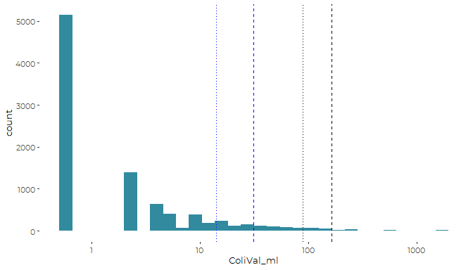
As for the Beaches data:  
1. Non detects are highly abundant.  
2. Violations of standards are relatively rare.

(Dotted lines apply to Geometric Mean; Dashed lines apply to P90.
Roughly speaking, the Blue lines are for the boundary between open and
restricted, black lines are for the boundary between restricted and
prohibited.)

``` r
ggplot(coli_data, aes(ColiVal_ml)) +
  geom_histogram(fill = cbep_colors()[5]) +
  geom_vline(xintercept = 14, lty = 3, col = 'blue') +
  geom_vline(xintercept = 31, lty = 2, col = 'blue') +
  geom_vline(xintercept = 88, lty = 3) +
  geom_vline(xintercept = 163, lty = 2) +
  scale_x_log10() +
  scale_y_log10() +

  theme_cbep(base_size = 10)
#> `stat_bin()` using `bins = 30`. Pick better value with `binwidth`.
#> Warning: Transformation introduced infinite values in continuous y-axis
#> Warning: Removed 3 rows containing missing values (geom_bar).
```

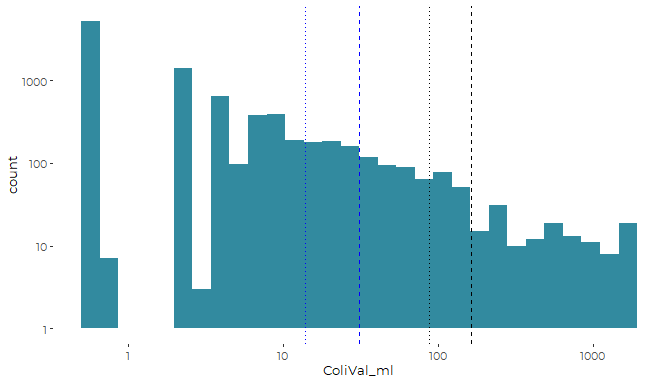
And that looks very much like a linear relationship on a log-log plot,
suggesting a gamma or Pareto distribution is appropriate. Prior
exploratory analysis suggests a Pareto Distribution is better, but that
adds considerable complexity to interpreting model results because of
the available modeling tools.

## Pareto Fit?

``` r
paretofit = vglm(ColiVal_ml~ 1, paretoII(location = 0) , data = coli_data)
parms <- exp(coef(paretofit))
names(parms) <- c('Scale', 'Shape')
parms
#>    Scale    Shape 
#> 1.390057 0.927623
#predict(paretofit, newdata = data.frame(x = 1))
```

``` r
ggplot(coli_data,aes(x = ColiVal_ml)) +
  geom_histogram(aes( y = ..density..)) +
  geom_vline(xintercept = 14, lty = 3, col = 'blue') +
  geom_vline(xintercept = 31, lty = 2, col = 'blue') +
  geom_vline(xintercept = 88, lty = 3) +
  geom_vline(xintercept = 163, lty = 2) +
  scale_x_log10() +
  scale_y_log10() +

  theme_cbep(base_size = 10) +
  
  geom_function(fun = dparetoII,
                 args = list(location = 0,
                             scale = parms[[1]],
                             shape = parms[[2]]),
                 color = 'red')
#> `stat_bin()` using `bins = 30`. Pick better value with `binwidth`.
#> Warning: Transformation introduced infinite values in continuous y-axis
#> Warning: Removed 3 rows containing missing values (geom_bar).
```

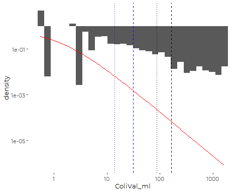

So we have a scaling problem, but the overall pattern does not look
wildly inappropriate….

## Simple Time Plot

### Create Geometric Mean Function

``` r
gm_mean <- function(x) {
  exp(mean(log(x), na.rm = TRUE))
}
```

### Plot

``` r
ggplot(coli_data, aes(YEAR, ColiVal_ml)) +
  geom_jitter(alpha = 0.5) +
  ## We use the MEAN here because `stat_summary()` works on data after
  ## applying the transformation to the y axis, thus implicitly calculating the
  ## geometric mean.
  stat_summary(fun = mean, fill = 'red', shape = 23) +

  geom_hline(yintercept = 14, lty = 3, col = 'blue') +
  geom_hline(yintercept = 31, lty = 2, col = 'blue') +
  geom_hline(yintercept = 88, lty = 3) +
  geom_hline(yintercept = 163, lty = 2) +

  scale_y_log10() +

  theme_cbep(base_size = 10)
#> Warning: Removed 5 rows containing missing values (geom_segment).
```


# Data Summaries

``` r
cat('\nNon-detects at Detection Limit\n')
#> 
#> Non-detects at Detection Limit
summary(coli_data$ColiVal)
#>    Min. 1st Qu.  Median    Mean 3rd Qu.    Max. 
#>    2.00    2.00    2.00   17.08    4.00 1600.00
cat('\n     Geometric Mean\n')
#> 
#>      Geometric Mean
exp(mean(log(coli_data$ColiVal)))
#> [1] 3.612195
cat('\n\n')

cat('\nNon-detects at maximum likelihood estimator\n')
#> 
#> Non-detects at maximum likelihood estimator
summary(coli_data$ColiVal_ml)
#>      Min.   1st Qu.    Median      Mean   3rd Qu.      Max. 
#>    0.5393    0.6093    0.6350   16.3186    4.0000 1600.0000
cat('\n     Geometric Mean\n')
#> 
#>      Geometric Mean
exp(mean(log(coli_data$ColiVal_ml)))
#> [1] 1.887169
```

Note that the medians are right at the detection limits (or our
re-casting of those to handle non-detects). Also, the 75th percentile is
at 4.0, just double the detection limit, and probably the next available
value under the MPN method.

## Summary Statistics Dataframe

``` r
sum_data <- coli_data %>%
  mutate(logcoli = log(ColiVal),
         logcoli2 = log(ColiVal_ml)) %>%
  group_by(Station) %>%
  summarize(mean1 = mean(ColiVal),
            median1 = median(ColiVal),
            iqr1 = IQR(ColiVal),
            p901 = quantile(ColiVal, 0.9),
            meanlog1 = mean(logcoli, na.rm = TRUE),
            sdlog1 = sd(logcoli, na.rm = TRUE),
            nlog1 = sum(! is.na(logcoli)),
            selog1 = sdlog1/sqrt(nlog1),
            gmean1 = exp(meanlog1),
            U_CI1 = exp(meanlog1 + 1.96 * selog1),
            L_CI1 = exp(meanlog1 - 1.96 * selog1),
            
            mean2 = mean(ColiVal_ml),
            median2 = median(ColiVal_ml),
            iqr2 = IQR(ColiVal_ml),
            p902 = quantile(ColiVal_ml, 0.9),
            meanlog2 = mean(logcoli2, na.rm = TRUE),
            sdlog2 = sd(logcoli2, na.rm = TRUE),
            nlog2 = sum(! is.na(logcoli2)),
            selog2 = sdlog1/sqrt(nlog2),
            gmean2 = exp(meanlog2),
            U_CI2 = exp(meanlog2 + 1.96 * selog2),
            L_CI2 = exp(meanlog2 - 1.96 * selog2)) %>%
  mutate(Station = fct_reorder(Station, gmean2))
```

### Graphic

``` r
plt <- ggplot(sum_data, aes(gmean2, Station)) + 
  geom_pointrange(aes(xmin = L_CI2, xmax = U_CI2),
                  color = cbep_colors()[4],
                  size = .2) +
  scale_x_log10(breaks = c(1,3,10,30, 100)) +
  
  xlab('Geometric Mean E. coli \n(MPN CFU/100 ml)') +
  ylab('Location') +
  
  theme_cbep(base_size = 12) + 
  theme(axis.text.y = element_blank(),
        axis.ticks.y = element_blank(),
        axis.line  = element_line(size = 0.5, 
                                  color = 'gray85'),
        panel.grid.major.x = element_line(size = 0.5, 
                                          color = 'gray85', 
                                          linetype = 2)) 

plt
```

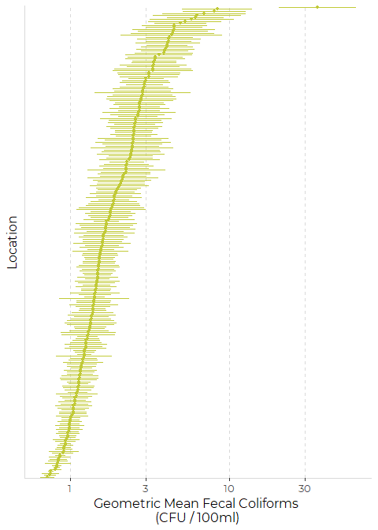

# Modeling

Overall, we focus on models that explore differences among sampling
stations. Under that principal goal, we examine:

1.  Impact of rainfall on those station by station estimates;
2.  Examination of differences among DMR Growing Areas, as a convenient
    summary for regional patterns
3.  Seasonal patterns.

Modeling here emphasizes understanding of patterns, not estimation, as
results in State of Casco Bay will emphasize observed metrics, like
geometric means.

We use three different methods: linear models, gamma generalized linear
models, and hierarchical models, developed through GAMs with random
effects.

## Simple Log Linear Model

Although we think a simple linear model is inappropriate given the
highly skewed data, we look at it anyway as a starting point for
analysis.

``` r
test_lm <- lm(log(ColiVal_ml) ~ Station, data = coli_data)
plot(test_lm)
```

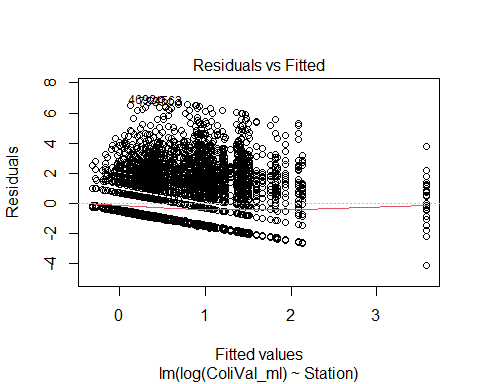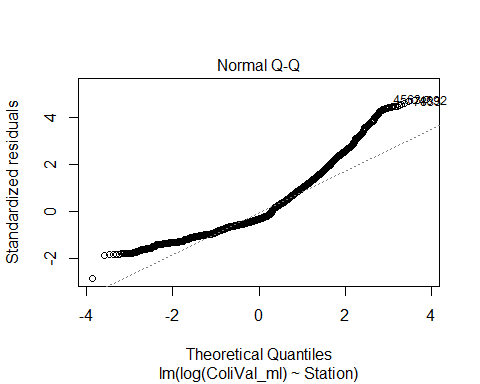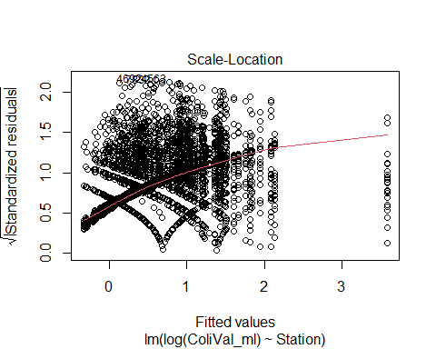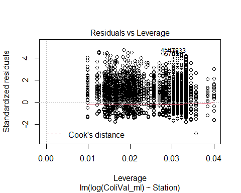
The model fails to address extreme values. You see clear relationships
between location and scale. Some of the pattern reflects the discrete
nature of the lower observations. A better model might need t explicitly
model interval censored data.

``` r
anova(test_lm)
#> Analysis of Variance Table
#> 
#> Response: log(ColiVal_ml)
#>             Df  Sum Sq Mean Sq F value    Pr(>F)    
#> Station    237  2684.9 11.3287  5.2101 < 2.2e-16 ***
#> Residuals 9161 19919.6  2.1744                      
#> ---
#> Signif. codes:  0 '***' 0.001 '**' 0.01 '*' 0.05 '.' 0.1 ' ' 1
```

As suspected, the comparisons are highly significant. Stations differ.

We have a significant challenge here figuring out how to address or even
display what are essentially thousands of pairwise comparisons. We use
`emmeans()` as a convenient way to extract station by station estimates
and standard errors. We use `type = 'response'` to generate estimated
geometric means an 95% confidence intervals.

``` r
emms <- summary(emmeans(test_lm, "Station", type = 'response')) %>%
  arrange(response) %>%
  mutate(Station =fct_reorder(Station, response)) %>%
  rename(geom_mean = response) %>%
  as_tibble()
```

### Graphic

``` r
plt <- ggplot(emms, aes(geom_mean, Station)) + 
  geom_pointrange(aes(xmin = lower.CL, xmax = upper.CL),
                  color = cbep_colors()[4],
                  size = .2) +
 
  scale_x_log10(breaks = c(1,3,10,30, 100)) +
  
  xlab('Geometric Mean E. coli \n(MPN CFU/100 ml)') +
  ylab('Location') +
  
  theme_cbep(base_size = 12) + 
  theme(axis.text.y = element_blank(),
        axis.ticks.y = element_blank(),
        axis.line  = element_line(size = 0.5, 
                                  color = 'gray85'),
        panel.grid.major.x = element_line(size = 0.5, 
                                          color = 'gray85', 
                                          linetype = 2)) 

plt
```

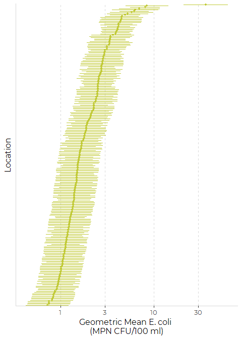
So only one site has estimated long-term geometric mean that exceeds the
geometric mean standard between

``` r
plt +
  stat_summary(fun = mean, mapping = aes(x=ColiVal_ml, y=Station), 
               data = coli_data,
               fill = 'red', shape = 23)
#> Warning: Removed 238 rows containing missing values (geom_segment).
```

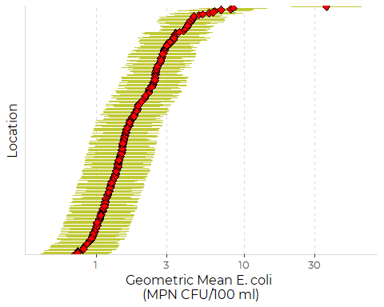

So our model regenerates the observed geometric means, as expected.

## Linear Rainfall Model

Most likely, a rainfall predictor would be useful. We assemble rainfall
data based on NOAA weather data. Rainfall data is **also** highly
skewed, so we focus on the and look at the log of rainfall. Our
predictors are log of the prior day’s rainfall, the log of the current
day’s rainfall, and the log of from the prior two days.

We have multiple possible predictors. If we take them one at a time,
which is best?

``` r
rain_lm_1 <- lm(log(ColiVal_ml) ~ Station + Log1Precip,  data = coli_data)
rain_lm_2 <- lm(log(ColiVal_ml) ~ Station + Log1Precip_d1,  data = coli_data)
rain_lm_3 <- lm(log(ColiVal_ml) ~ Station + Log1Precip_d2,  data = coli_data)
rain_lm_4 <- lm(log(ColiVal_ml) ~ Station + Log1Precip + Log1Precip_d1,
                data = coli_data)
rain_lm_5 <- lm(log(ColiVal_ml) ~ Station + Log1Precip + 
                  Log1Precip_d1 + Log1Precip_d2,
                data = coli_data)
```

``` r
anova(rain_lm_1, rain_lm_2, rain_lm_3, rain_lm_4, rain_lm_5)
#> Analysis of Variance Table
#> 
#> Model 1: log(ColiVal_ml) ~ Station + Log1Precip
#> Model 2: log(ColiVal_ml) ~ Station + Log1Precip_d1
#> Model 3: log(ColiVal_ml) ~ Station + Log1Precip_d2
#> Model 4: log(ColiVal_ml) ~ Station + Log1Precip + Log1Precip_d1
#> Model 5: log(ColiVal_ml) ~ Station + Log1Precip + Log1Precip_d1 + Log1Precip_d2
#>   Res.Df   RSS Df Sum of Sq        F Pr(>F)    
#> 1   9158 19264                                 
#> 2   9158 18884  0    379.95                    
#> 3   9158 19885  0  -1000.81                    
#> 4   9157 18339  1   1545.76 771.9406 <2e-16 ***
#> 5   9156 18334  1      5.12   2.5583 0.1098    
#> ---
#> Signif. codes:  0 '***' 0.001 '**' 0.01 '*' 0.05 '.' 0.1 ' ' 1
rm(rain_lm_1, rain_lm_2, rain_lm_3, rain_lm_4, rain_lm_5)
```

Rainfall is highly significant. The best single predictor is based on
the previous day’s rainfall 9Model 2) adding the current day’s rainfall
helps a bit more. Including the current day’s rainfall also helps. but
the reduction in sums of squares.

``` r
rain_lm <- lm(log(ColiVal_ml) ~ Station + Log1Precip + 
                Log1Precip_d1, data = coli_data)
```

``` r
summary(rain_lm)$coefficients[239:240,]
#>                Estimate Std. Error t value      Pr(>|t|)
#> Log1Precip    0.2339226 0.01418108 16.4954  2.915961e-60
#> Log1Precip_d1 0.3143605 0.01462836 21.4898 5.561366e-100
```

So conditions are more dependent on the prior day’s rainfall.

#### Extract Adjusted Station by Station Estimates

Note that we specify marginal means calculated for a day without
rainfall, rather than for a day with “average” rainfall, which would be
higher, or a day with median rainfall. We could have used
`cov.reduce = median`, since median rainfall **was** zero, but that
could lead to inconsistent models with other data.

``` r
emms <- summary(emmeans(rain_lm, "Station", type = 'response',
                        at = list(LogPrecip_d1 = 0, LogPrecip = 0))) %>%
  arrange(response) %>%
  mutate(Station =fct_reorder(Station, response)) %>%
  rename(geom_mean = response) %>%
  as_tibble()
```

### Graphic

``` r
plt <- ggplot(emms, aes(geom_mean, Station)) + 
  geom_pointrange(aes(xmin = lower.CL, xmax = upper.CL),
                  color = cbep_colors()[4],
                  size = .2) +
  scale_x_log10(breaks = c(1,3,10,30, 100)) +
  
  xlab('Geometric Mean E. coli \n(MPN CFU/100 ml)') +
  ylab('Location') +
  
  theme_cbep(base_size = 12) + 
  theme(axis.text.y = element_blank(),
        axis.ticks.y = element_blank(),
        axis.line  = element_line(size = 0.5, 
                                  color = 'gray85'),
        panel.grid.major.x = element_line(size = 0.5, 
                                          color = 'gray85', 
                                          linetype = 2)) 
plt
```

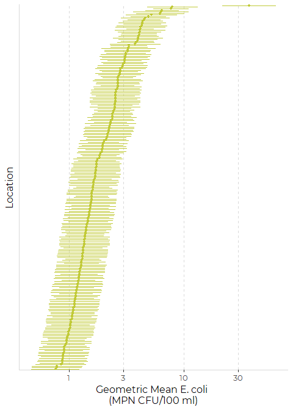

#### Check Relationship with Geometric Means

``` r
plt +
  stat_summary(fun = mean, mapping = aes(x=ColiVal_ml, y=Station), 
               data = coli_data,
               fill = 'red', shape = 23)
#> Warning: Removed 238 rows containing missing values (geom_segment).
```

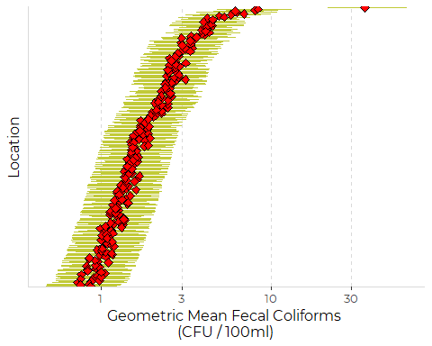
The match is not perfect anymore, as expected since the MLEs now are
corrected for recent rainfall, but the correlation is close. Note that
the confidence intervals are wider than the scatter among geometric
means, so differences among sites dominate, but rainfall still matters.

## Selection of GLM Family

Preliminary analyses suggested that models were more successful
predicting the log of bacteria levels. Bacteria levels appear to be
distributed close to a (censored) Pareto distribution.

Modeling based on log transformed data has the advantage of meaning our
models readily generate geometric means, to which the regulations are
linked.

Even after log-transformation, however, our data is highly skewed, so we
need a GLM that can handle skewed data. Usually, gamma and inverse
Gaussian GLMs are recommended for skewed (positive continuous) data.

We explored both gamma GLMs and inverse Gaussian GLMs. Both can handle
skewed data but are restricted to data that ranges over the positive
real numbers. For the negative binomial GLMs, we examined several link
functions, (1/mu^2, inverse, identity). Results for all alternative GLMs
were qualitatively similar.

The inverse Gaussian models perform relatively poorly (based on model
diagnostic plots), so we focus on models based on the Gamma GLM (or
Gamma GAM).

Log transform of counts are positive, except for count = 0, where the
log is undefined. (Given our interest in interpreting results in terms
of the geometric mean, we do not want to add one to all counts to avoid
zeros.)

The effect is that we are restricted with regards to how we handle
non-detects. There are several conventions regarding appropriate
analysis of non-detects:

1.  Replace non-detects with their reporting limits;  
2.  Replace non-detects with zero;  
3.  Replace non-detects with half the reporting limit;  
4.  Replace non-detects with a statistically-based estimate of missing
    values.

While we generally prefer (4), we can not use that here, as reasonable
MLE estimates of the conditional means of (unobserved) non-detects are
below 1, which would lead to negative logs. Similarly, we can not go
with (2). Both (1) and (3) are viable alternatives. (1) uses
`ColiVal', and (3) uses`ColiVal\_hf\`.

We found, however, that the gamma GLM can not readily handle the log of
our count data if we replace our non-detects by the value 1 (which is
half the reporting limit). The reason, of course, is that `log(1) == 0`,
and the canonical link function for a gamma GLM is the inverse, so the
value of 1 returns an infinite link function, making teh GLM model
unstable. Even when we replace `ND <- 1` with `ND <- 1.1`, the GLM has
trouble fitting some fairly simple models.

We therefore largely fall back on alternative (1), which we usually
avoid. Again, qualitative results do not change much, but model
stability improves.

## Simple Gamma GLM

Note that we are NOT using non-detect corrected data here, because it
includes values below 1, which leads to log of values below 0, which the
gamma models can not handle.

``` r
gamma_glm <- glm(log(ColiVal) ~ Station, 
                family = Gamma(), 
                data = coli_data)
```

``` r
boot::glm.diag.plots(gamma_glm)
```

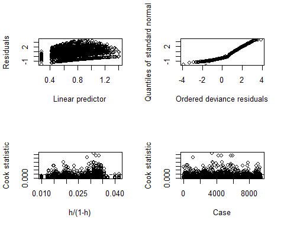
That addresses the extreme values more successfully than our linear
models, but not entirely. The scale-location relationship remains, but
has been reduced in importance and partially reversed.

``` r
emms <- summary(emmeans(gamma_glm, "Station", type = 'response')) %>%
  arrange(response) %>%
  mutate(Station =fct_reorder(Station, response)) %>%
  rename(geom_mean = response) %>%
  as_tibble()
```

#### Graphic

``` r
plt <- ggplot(emms, aes(geom_mean, Station)) + 
  geom_pointrange(aes(xmin = asymp.LCL, xmax = asymp.UCL),
                  color = cbep_colors()[4],
                  size = .2) +
  scale_x_log10(breaks = c(1,3,10,30, 100)) +
  
  xlab('Geometric Mean E. coli \n(MPN CFU/100 ml)') +
  ylab('Location') +
  
  theme_cbep(base_size = 12) + 
  theme(axis.text.y = element_blank(),
        axis.ticks.y = element_blank(),
        axis.line  = element_line(size = 0.5, 
                                  color = 'gray85'),
        panel.grid.major.x = element_line(size = 0.5, 
                                          color = 'gray85', 
                                          linetype = 2)) 

plt
```


Qualitatively, that is similar to results from the linear model, with
confidence intervals that scale with the geometric means, which makes
sense both with these data and with a gamma model.

``` r
plt +
   stat_summary(fun = mean, mapping = aes(x=ColiVal, y=Station), 
                data = coli_data,
                fill = 'red', shape = 23)
#> Warning: Removed 238 rows containing missing values (geom_segment).
```

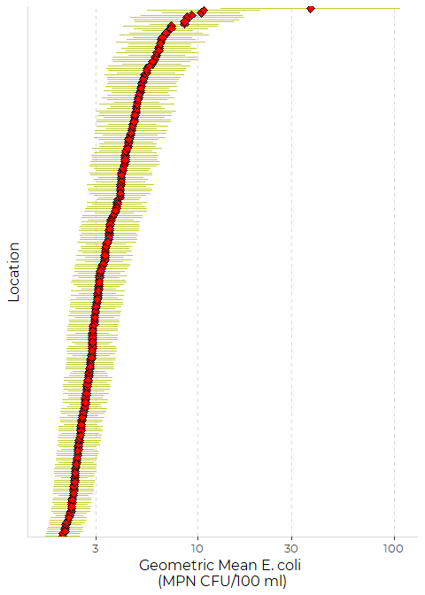
So the the predicted values still match the observed geometric means.
Note that these geometric means are slightly higher than the ones
produced by fitting our non-detect corrected data, or fitting the
version with non-detects scaled to half the nominal reporting limit,
since we are replacing the non-detects with their reporting limits here.

## Inverse Gaussian GLM

``` r
ig_glm <- glm(log(ColiVal) ~ Station, 
                family = inverse.gaussian(), 
                data = coli_data)
```

``` r
boot::glm.diag.plots(ig_glm)
```

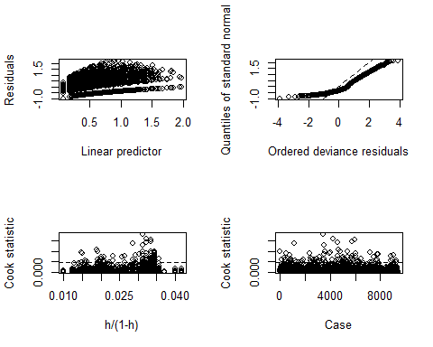

The inverse Gaussian GLMs do slightly better addressing the
location-scale relationship. But residuals are larger, more heavily
skewed, and contain a “kink” that apparently depends on how we handle
the non-detects. We prefer the gamma models, and continue examining only
those models.

## Rainfall Gaussian GLM

We focus on a model that includes information on rainfall from the prior
day and the day of sampling (guided by our linear model analysis).

``` r
rain_glm <- glm(log(ColiVal) ~ Station + Log1Precip + 
                Log1Precip_d1, 
                family = Gamma(), 
                data = coli_data)
```

``` r
boot::glm.diag.plots(rain_glm)
```

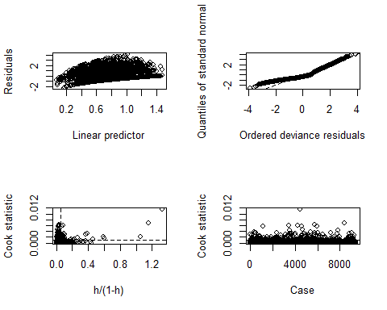
That leaves us with a distribution of residuals with a light lower tail,
but we also create some moderately high leverage values, and increase a
few elevated residuals. Judging by what we saw in the Beaches data,
those elevated residuals probably arise because of high values that do
not correspond to high rainfall, or moderate levels that correspond to
very high rainfall.

``` r
summary(rain_glm)$coefficients[239:240,]
#>                  Estimate  Std. Error   t value      Pr(>|t|)
#> Log1Precip    -0.06752937 0.004443998 -15.19564  1.601864e-51
#> Log1Precip_d1 -0.09436089 0.004350876 -21.68779 9.439090e-102
```

Previous day’s precipitation has more effect on current conditions than
present-day precipitation. (Note that because the link function here is
an inverse, a negative value implies the response is increasing).

### Results

Note this is the first place our selection of how we specify marginal
means are likely to be important. We fit for days with 0 recent
rainfall.

``` r
emms2 <- summary(emmeans(rain_glm, "Station", type = 'response',
                        at = list(LogPrecip_d1 = 0, LogPrecip = 0))) %>%
  arrange(response) %>%
  mutate(Station = fct_reorder(Station, response),
         GROW_AREA = coli_data$GROW_AREA[match(Station, coli_data$Station)]) %>%
  rename(geom_mean = response) %>%
  as_tibble()
```

### Graphic

We add colors by DMR Grow Region. This makes the graphic more confusing.
It shows clear differences among regions, so it was worth trying.

``` r
plt <- ggplot(emms2, aes(geom_mean, Station)) + 
  geom_pointrange(aes(xmin = asymp.LCL, xmax = asymp.UCL, color = GROW_AREA),
                  #color = cbep_colors()[4],
                  size = .2) +
  
  scale_x_log10(breaks = c(1,3,10,30, 100)) +
  
  xlab('Geometric Mean E. coli \n(MPN CFU/100 ml)') +
  ylab('Location') +
  
  scale_color_manual(values = cbep_colors()) +
  theme_cbep(base_size = 12) + 
  theme(axis.text.y = element_blank(),
        axis.ticks.y = element_blank(),
        axis.line  = element_line(size = 0.5, 
                                  color = 'gray85'),
        panel.grid.major.x = element_line(size = 0.5, 
                                          color = 'gray85', 
                                          linetype = 2)) 

plt
```

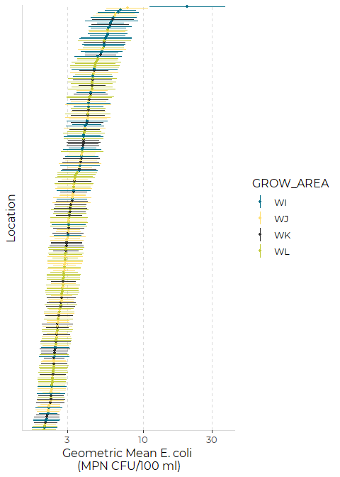
Qualitatively, that is similar to results from the prior model.

``` r
plt +
   stat_summary(fun = mean, mapping = aes(x=ColiVal, y=Station), 
                data = coli_data,
                fill = 'red', shape = 23)
#> Warning: Removed 238 rows containing missing values (geom_segment).
```

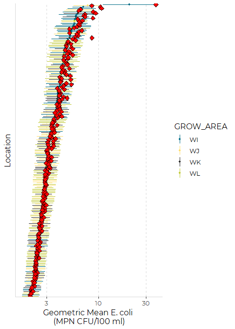

In this case, our estimated marginal means shifted below the observed
geometric means. This is expected, as we have chosen to estimate
marginal means for a day with no recent rainfall. The effect is fairly
large for a few high geometric mean sites. It’s not clear if that is a
modeling artifact or reflects the possibility that sites with higher
geometric means were (by chance?) sampled more after rain.

## Growing Regions GAM

We clearly have a hierarchical model here, with Stations nested within
Growing Areas. It is appropriate to treat the Stations (in this setting)
as random factors within Growing Areas. So we fit this as a GAM model,
using a random effects smoother.A functionally similar model could be
fit with `lme()` or `lmer()`

``` r
grow_gam <- gam(log(ColiVal) ~ GROW_AREA + s(Station, bs = 're'), 
                family = Gamma(), 
                data = coli_data)
```

``` r
anova(grow_gam)
#> 
#> Family: Gamma 
#> Link function: inverse 
#> 
#> Formula:
#> log(ColiVal) ~ GROW_AREA + s(Station, bs = "re")
#> 
#> Parametric Terms:
#>           df     F p-value
#> GROW_AREA  3 4.041   0.007
#> 
#> Approximate significance of smooth terms:
#>              edf Ref.df    F p-value
#> s(Station) 199.1  234.0 3.92  <2e-16
```

We see that grow area is a statistically significant predictor of
geometric mean levels of *E. coli* at the different stations.

### Plot

``` r
plot(grow_gam)
```

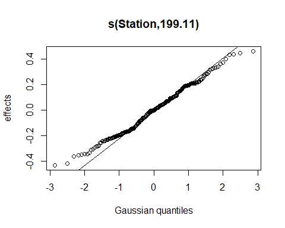
This plot shows the magnitude of the random effects. IDeally, these
residuals should be close to normally distributed. here we note that
they are somewhat skewed, but not excessively so.

``` r
summary(grow_gam)
#> 
#> Family: Gamma 
#> Link function: inverse 
#> 
#> Formula:
#> log(ColiVal) ~ GROW_AREA + s(Station, bs = "re")
#> 
#> Parametric coefficients:
#>             Estimate Std. Error t value Pr(>|t|)    
#> (Intercept)  0.71829    0.04259  16.864  < 2e-16 ***
#> GROW_AREAWJ  0.17709    0.05601   3.162  0.00157 ** 
#> GROW_AREAWK  0.11205    0.05817   1.926  0.05409 .  
#> GROW_AREAWL  0.16482    0.05462   3.018  0.00255 ** 
#> ---
#> Signif. codes:  0 '***' 0.001 '**' 0.01 '*' 0.05 '.' 0.1 ' ' 1
#> 
#> Approximate significance of smooth terms:
#>              edf Ref.df    F p-value    
#> s(Station) 199.1    234 3.92  <2e-16 ***
#> ---
#> Signif. codes:  0 '***' 0.001 '**' 0.01 '*' 0.05 '.' 0.1 ' ' 1
#> 
#> R-sq.(adj) =  0.0917   Deviance explained = 16.4%
#> GCV = 0.42066  Scale est. = 0.62667   n = 9399
```

Because the link function is the inverse, a lower value here implies a
higher geometric mean. The default base case here is
`GROW_AREA == "HI"`. That is the highest bacteria region, with the other
regions showing generally lower concentrations. Pairwise coefficients
are not individually significant (or in one case marginally so).

``` r
myemms <- emmeans(grow_gam, "GROW_AREA",
                         nesting = "Station %in% GROW_AREA")

pwpp(myemms)
#> Note: Use 'contrast(regrid(object), ...)' to obtain contrasts of back-transformed estimates
```


``` r
rm(myemms)
```

So, in pairwise comparisons, “WI” has lower linear predictor (higher
response) than all the other sites. In addition.," “WK” is significantly
worse off than “WJ” and nearly significantly worse of f than “WL”.

(Results are less clear cut if we analyze ColiVal\_hf, where we replace
non-detects by half their value, but then the model is unstable.)

``` r
emms3 <- summary(emmeans(grow_gam, "GROW_AREA", type = 'response',
                         nesting = "Station %in% GROW_AREA")) %>%
  arrange(response) %>%
  rename(geom_mean = response) %>%
  as_tibble()
emms3
#> # A tibble: 4 x 6
#>   GROW_AREA geom_mean     SE    df lower.CL upper.CL
#>   <fct>         <dbl>  <dbl> <dbl>    <dbl>    <dbl>
#> 1 WJ             3.06 0.0529 9196.     2.95     3.16
#> 2 WL             3.10 0.0569 9196.     2.99     3.22
#> 3 WK             3.33 0.0732 9196.     3.19     3.48
#> 4 WI             4.02 0.112  9196.     3.81     4.25
```

Note that although we have statistically significant differences among
regions, the actual bacteria levels are low, and differences are
quantitatively small. Error bars on the estimated geometric means are
smaller than the plotting symbols.

### Graphic

``` r
plt <- ggplot(emms3, aes(GROW_AREA, geom_mean)) + 
  geom_jitter(data = coli_data, mapping = aes(x = GROW_AREA, 
                                             y = ColiVal,
                                             color = LCFlag),
              alpha = 0.25) +
  geom_line(aes(x = as.numeric(GROW_AREA)), color = 'red') +
  geom_pointrange(aes(ymin = lower.CL, ymax = upper.CL),
                  color = 'red', size = .75, shape = 17) +
 
  scale_y_log10() +
  scale_color_manual(values = cbep_colors(), name = '', 
                     labels = c('Observed', 'Below Detection')) +
  ylab('Geometric Mean E. coli \n(MPN CFU/100 ml)') +
  xlab('DMR Growing Area') +
  
  theme_cbep(base_size = 12) +
  theme(legend.position = 'bottom')

plt
```

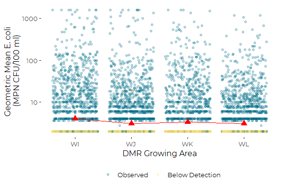

## Seasonal Model

We chose to use a hierarchical mixed model here as well, because
measurements collected at any single Station are correlated. This makes
the model akin to a repeated measures model. An equivalent model could
be fit with `lmer()` or `lme()`.

``` r
month_gam <- gam(log(ColiVal) ~ Month + s(Station, bs = 're'), 
                family = Gamma(), 
                data = coli_data)
```

This model failed to converge cleanly when fit against `ColiVal_hf`.  
We do not see those problems when fitting the uncorrected data, as here.
That suggests that our model (a gamma fit, with inverse link on log
transformed data) has trouble with fitting the values of the non-detects
when we replace non-detects with a value of 1.

Those warnings suggest problems with convergence. That is not all that
surprising, since both rainfall and *E. coli* levels are highly skewed –
and the correlations between them, while important, are not perfect.

``` r
plot(month_gam)
```


The random effects are again skewed.

``` r
summary(month_gam)
#> 
#> Family: Gamma 
#> Link function: inverse 
#> 
#> Formula:
#> log(ColiVal) ~ Month + s(Station, bs = "re")
#> 
#> Parametric coefficients:
#>             Estimate Std. Error t value Pr(>|t|)    
#> (Intercept)  1.15888    0.05450  21.264  < 2e-16 ***
#> MonthFeb    -0.04575    0.06967  -0.657   0.5114    
#> MonthMar     0.11179    0.06560   1.704   0.0884 .  
#> MonthApr     0.04564    0.05659   0.806   0.4200    
#> MonthMay    -0.10413    0.05559  -1.873   0.0611 .  
#> MonthJun    -0.47401    0.05263  -9.006  < 2e-16 ***
#> MonthJul    -0.37228    0.05382  -6.917 4.91e-12 ***
#> MonthAug    -0.38583    0.05299  -7.281 3.59e-13 ***
#> MonthSep    -0.39186    0.05361  -7.310 2.89e-13 ***
#> MonthOct    -0.42515    0.05362  -7.929 2.47e-15 ***
#> MonthNov    -0.45697    0.05313  -8.601  < 2e-16 ***
#> MonthDec    -0.13926    0.06082  -2.290   0.0221 *  
#> ---
#> Signif. codes:  0 '***' 0.001 '**' 0.01 '*' 0.05 '.' 0.1 ' ' 1
#> 
#> Approximate significance of smooth terms:
#>              edf Ref.df     F p-value    
#> s(Station) 209.6    237 5.621  <2e-16 ***
#> ---
#> Signif. codes:  0 '***' 0.001 '**' 0.01 '*' 0.05 '.' 0.1 ' ' 1
#> 
#> R-sq.(adj) =  0.171   Deviance explained = 27.5%
#> GCV = 0.36628  Scale est. = 0.52811   n = 9399
```

The summary shows a strong seasonal pattern, with winter months with
generally high coefficients ( == low geometric means), that are
significantly different from conditions in the late summer and fall.

### Pairwise Comparisons

``` r
myemms <- emmeans(month_gam, "Month")

pwpp(myemms) 
#> Note: Use 'contrast(regrid(object), ...)' to obtain contrasts of back-transformed estimates
```


``` r
rm(myemms)
```

The overall pattern is that June through November tend to not differ
(although each of those two months are sometimes different from one or
another month). December through May also tend to not differ,

### Results

``` r
emms4 <- summary(emmeans(month_gam, "Month", type = 'response',
                        at = list(LogPrecip_d1 = 0, LogPrecip = 0))) %>%
  rename(geom_mean = response) %>%
  as_tibble()
emms4
#> # A tibble: 12 x 6
#>    Month geom_mean     SE    df lower.CL upper.CL
#>    <fct>     <dbl>  <dbl> <dbl>    <dbl>    <dbl>
#>  1 Jan        2.37 0.0906 9177.     2.20     2.55
#>  2 Feb        2.46 0.0965 9177.     2.27     2.65
#>  3 Mar        2.20 0.0573 9177.     2.09     2.31
#>  4 Apr        2.29 0.0384 9177.     2.22     2.37
#>  5 May        2.58 0.0510 9177.     2.48     2.68
#>  6 Jun        4.31 0.120  9177.     4.08     4.55
#>  7 Jul        3.57 0.0984 9177.     3.38     3.76
#>  8 Aug        3.65 0.0885 9177.     3.48     3.82
#>  9 Sep        3.68 0.104  9177.     3.49     3.89
#> 10 Oct        3.91 0.122  9177.     3.68     4.15
#> 11 Nov        4.16 0.135  9177.     3.90     4.43
#> 12 Dec        2.67 0.0869 9177.     2.50     2.84
```

Again, note how low the geometric means are.

### Graphic

``` r
plt <- ggplot(emms4, aes(Month, geom_mean)) + 
  geom_jitter(data = coli_data, mapping = aes(x = Month, 
                                             y = ColiVal,
                                             color = LCFlag),
              alpha = 0.25) +
  geom_line(aes(x = as.numeric(Month)), color = 'red') +
  geom_pointrange(aes(ymin = lower.CL, ymax = upper.CL),
                  color = 'red', size = .75, shape = 17) +
 
  scale_y_log10() +
  scale_color_manual(values = cbep_colors(), name = '', 
                     labels = c('Observed', 'Below Detection')) +
  ylab('Geometric Mean E. coli \n(MPN CFU/100 ml)') +
  xlab('DMR Growing Area') +
  
  theme_cbep(base_size = 12) +
  theme(legend.position = 'bottom')

plt
```

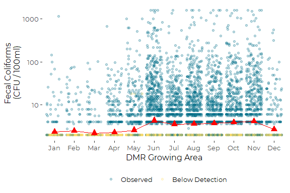

``` r
plt +
   stat_summary(fun = mean, mapping = aes(y=ColiVal, x=Month), 
                data = coli_data,
                fill = 'yellow', shape = 23)
#> Warning: Removed 12 rows containing missing values (geom_segment).
```

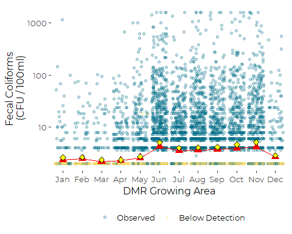

Estimated values are not exactly equal to observed geometric means. That
is expected, since the model estimates are corrected for sampling
histories of different Stations.

## Full Seasonal (DOY) model

We fit a cyclic smoother to the Day of the Year. Selection of the degree
of smoothing is a bit of an arbitrary call, but we generally prefer to
underfit rather than overfit GAM smoothers. The default fit used almost
eight degrees of freedom, and it fit what looked like a few too many
wiggles for a reasonable seasonal pattern. We try six knots, for a
slightly smoother fit.

``` r
doy_gam <- gam(log(ColiVal) ~ s(DOY, k = 6, bs = 'cc') + s(Station, bs = 're'), 
                family = Gamma(), 
                data = coli_data)
```

Recall that the linear predictor for our gamma GLM is the inverse.

``` r
plot(doy_gam)
```

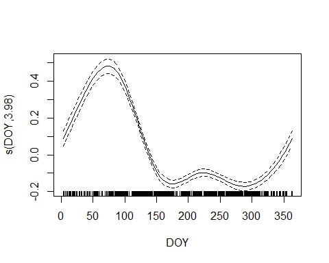

``` r
summary(doy_gam)
#> 
#> Family: Gamma 
#> Link function: inverse 
#> 
#> Formula:
#> log(ColiVal) ~ s(DOY, k = 6, bs = "cc") + s(Station, bs = "re")
#> 
#> Parametric coefficients:
#>             Estimate Std. Error t value Pr(>|t|)    
#> (Intercept)  0.88712    0.01975   44.91   <2e-16 ***
#> ---
#> Signif. codes:  0 '***' 0.001 '**' 0.01 '*' 0.05 '.' 0.1 ' ' 1
#> 
#> Approximate significance of smooth terms:
#>               edf Ref.df       F p-value    
#> s(DOY)       3.98      4 268.674  <2e-16 ***
#> s(Station) 209.31    237   5.587  <2e-16 ***
#> ---
#> Signif. codes:  0 '***' 0.001 '**' 0.01 '*' 0.05 '.' 0.1 ' ' 1
#> 
#> R-sq.(adj) =  0.166   Deviance explained = 26.4%
#> GCV = 0.37166  Scale est. = 0.53446   n = 9399
```

We want to compare predicted values and standard errors to observed
values. We can use predict to get estimates, but we have to get them for
all stations and average. The provided estimates of standard error,
therefore, are not correct, as they track only between station error,
not within station error.

``` r
s <- unique(coli_data$Station)
l = length(s)
df <- data.frame(DOY = rep(1:365, l), Station = rep(s, each = 365))

p <- predict(doy_gam, newdata = df)

p <- tibble(fit = p) %>%
  mutate(DOY = rep(1:365, l), 
         Station = rep(s, each = 365)) %>%
  group_by(DOY) %>%
  summarize(mean_lp = mean(fit),
            sd_lp = sd(fit),
            mean_response = 1/mean_lp,
            upper_response = 1/(mean_lp + 1.96* sd_lp),
            lower_response = 1/(mean_lp - 1.96* sd_lp),
            gmean = exp(mean_response),
            upper_gmean = exp(upper_response),
            lower_gmean = exp(lower_response))
```

``` r
ggplot(coli_data, aes(DOY, ColiVal)) +
  geom_jitter(alpha = 0.1, height = 0.01) +
  geom_line(data = p, mapping = aes(x = DOY, y = gmean), 
             color = 'red', size = 1) +
  scale_y_log10()
```

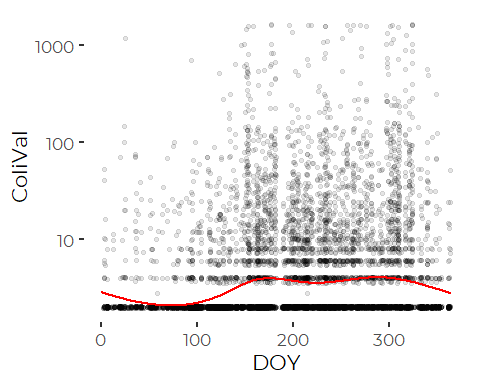

``` r
emms5 <- summary(emmeans(doy_gam, 
                         'DOY', at = list(DOY = 1:365),
                         type = 'response'))%>%
  rename(geom_mean = response) %>%
  as_tibble()
```

### Graphic

``` r
plt <- ggplot(emms5, aes(DOY, geom_mean)) + 
  geom_jitter(data = coli_data, mapping = aes(x = DOY, 
                                             y = ColiVal,
                                             color = LCFlag),
              alpha = 0.25) +
  geom_line(aes(x = as.numeric(DOY)), color = 'red', size = 1) +
  geom_linerange(aes(ymin = lower.CL, ymax = upper.CL),
                  color = 'red', size = .25, alpha = 0.25) +
 
  scale_y_log10() +
  scale_color_manual(values = cbep_colors(), name = '', 
                     labels = c('Observed', 'Below Detection')) +
  ylab('Geometric Mean E. coli \n(MPN CFU/100 ml)') +
  xlab('Day of the Year') +
  
  theme_cbep(base_size = 12) +
  theme(legend.position = 'bottom')

plt
```

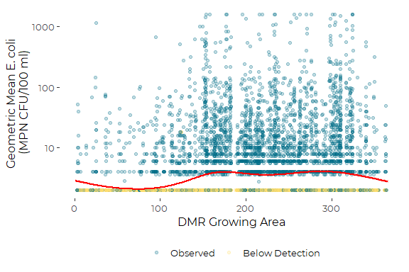

## Pareto Models

We were unable to run a Pareto models successfully under `VGAM`.

``` r
tmp <- coli_data %>%
  filter (! is.na(ColiVal))
pareto_vglm <- vglm(ColiVal ~ Station, 
                    paretoII, data = tmp,
                    maxit = 50)
#> Error in checkwz(wz, M = M, trace = trace, wzepsilon = control$wzepsilon): NAs found in the working weights variable 'wz'
anova.vglm(pareto_vglm)
#> Error in h(simpleError(msg, call)): error in evaluating the argument 'object' in selecting a method for function 'has.intercept': object 'pareto_vglm' not found
rm(tmp)
```

## Nonparametric Tests

We proceed to a nonparametric analysis. This is useful for a one way
analysis, but does not lend itself to testing more complex models.

``` r
kruskal.test(ColiVal_ml ~ Station, data = coli_data)
#> 
#>  Kruskal-Wallis rank sum test
#> 
#> data:  ColiVal_ml by Station
#> Kruskal-Wallis chi-squared = 875.44, df = 237, p-value < 2.2e-16
```

Although the Kruskal-Wallis test is not strictly a comparison of
medians, it’s close, so we look at medians again.

``` r
sum_data %>%
  mutate(Station = fct_reorder(Station, median2)) %>%
  
  ggplot(aes(median2, Station)) +
  geom_point() +

  scale_x_log10() + 

  theme_cbep(base_size = 12) + 
  theme(axis.text.y = element_blank(),
        axis.ticks.y = element_blank(),
        axis.line  = element_line(size = 0.5, 
                                  color = 'gray85'),
        panel.grid.major.x = element_line(size = 0.5, 
                                          color = 'gray85', 
                                          linetype = 2))
```

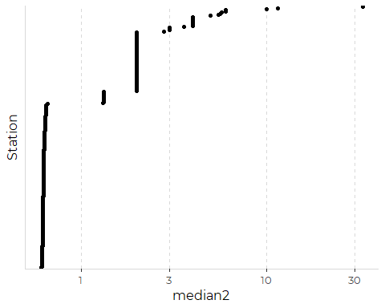

Note how many of those medians are at (or very close to) discrete values
determined by the methods involved. **Most** sites **almost always** are
below detection limits or at very low levels.

### Pairwise Wilcoxon test

Although a pairwise analysis is possible, it is not very informative
with so many stations.

The following is moderately slow…. Many warnings are produced, all
saying exact p values are not possible with tied values – of which we
have many.

The giant cross classification matrix is hard to parse, so this is not
especially useful without a lot more work. We don’t need it, as results
will generally confirm that some Stations are different from others,
which we know.

``` r
res <- suppressWarnings(
    pairwise.wilcox.test(coli_data$ColiVal_ml,
                         coli_data$Station,
                         p.adjust.method = "holm"))
```

Differences among sites are statistically meaningful, but pairwise
comparisons are too numerous to be especially informative. Some sites
differ from others, but other than the

# Output Table for GIS

``` r
sum_data %>%
  select(Station, median1, iqr1, gmean1, p901, nlog1, 
                  median2, iqr2, gmean2, p902, nlog2 ) %>%
  rename(median = median1,
         igr = iqr1, 
         gmean = gmean1, 
         p90 = p901,
         nlog = nlog1,
         
         median_ml = median2, 
         iqr_ml = iqr2,
         gmean_ml = gmean2, 
         p90_ml = p902, 
         nlog_ml = nlog2) %>%
  write.csv('bacteria_summaries.csv')
```
