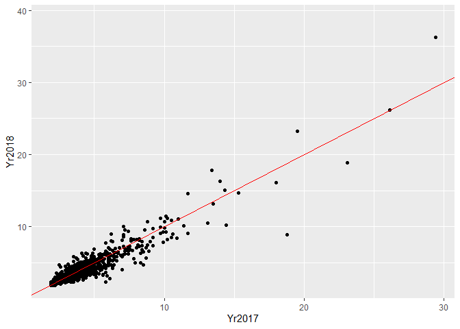
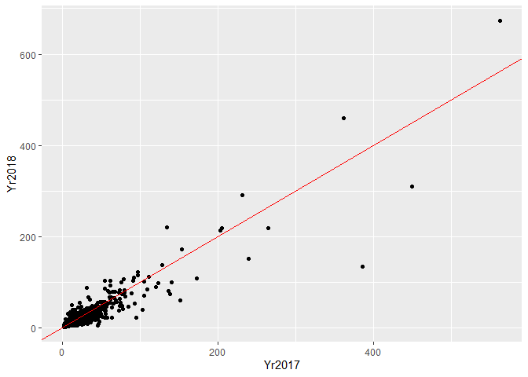

Shellfish Sanitation Program Data Review and Assembly
================
Curtis C. Bohlen, Casco Bay Estuary Partnership.
11/14/2020

  - [Install Libraries](#install-libraries)
  - [Load p90 Data](#load-p90-data)
      - [Folder References](#folder-references)
      - [Read Data](#read-data)
      - [Finalize Combined p90 Data](#finalize-combined-p90-data)
  - [Extract list of Locations /
    Stations](#extract-list-of-locations-stations)
      - [Export Locations Data As CSV
        Files](#export-locations-data-as-csv-files)
  - [P90 Data Review](#p90-data-review)
      - [Check Consistency of names and
        order](#check-consistency-of-names-and-order)
      - [The summary data is not what it
        appears](#the-summary-data-is-not-what-it-appears)
      - [Check Data Structure](#check-data-structure)
      - [Data Consistency](#data-consistency)
  - [Raw Observations 2015 through
    2018](#raw-observations-2015-through-2018)
      - [Load Data](#load-data)
      - [Review Status of Data](#review-status-of-data)
      - [Convert NNE wind direction to
        N](#convert-nne-wind-direction-to-n)
      - [Convert Order of Factors](#convert-order-of-factors)
      - [Simplify Column Names](#simplify-column-names)
  - [Deal With Censoring](#deal-with-censoring)
  - [Data export](#data-export)
  - [Final Data Cleanup](#final-data-cleanup)


# Install Libraries

``` r
library(readr)
library(readxl)
library(tidyverse)
```

    ## -- Attaching packages ----------------------------------------------------------------------------------- tidyverse 1.3.0 --

    ## v ggplot2 3.3.2     v dplyr   1.0.2
    ## v tibble  3.0.3     v stringr 1.4.0
    ## v tidyr   1.1.2     v forcats 0.5.0
    ## v purrr   0.3.4

    ## -- Conflicts -------------------------------------------------------------------------------------- tidyverse_conflicts() --
    ## x dplyr::filter() masks stats::filter()
    ## x dplyr::lag()    masks stats::lag()

# Load p90 Data

First we create a string that gets us to our sibling folder, then load
the data. Unfortunately, the data file formats are not entirely
compatible, so we need to handle this carefully.

## Folder References

``` r
sibfldnm <- 'Original_Data'
parent <- dirname(getwd())
sibling <- file.path(parent,sibfldnm)

fl1<- "2016 p90 for CBEP.xlsx"
fl2 <- "2017 p90 for CBEP.xlsx"
fl3 <- "MaineDMR_Public_Health__2018_P90_Scores.csv"
fl4 <- "Casco Bay WQ 15.19.csv"
```

## Read Data

``` r
path <- file.path(sibling, fl1)
p90_data_2016 <- read_excel(path) %>%
  select(-OBJECTID) %>%
  select(-Min_Date) %>%
  mutate(Year = 2016)

path <- file.path(sibling, fl2)
p90_data_2017 <- read_excel(path) %>%
  select(-OBJECTID) %>%
  select(-Min_Date) %>%
  mutate(Year = 2017)

path <- file.path(sibling, fl3)
p90_data_2018 <- read_csv(path) %>%
  select(-OBJECTID) %>%
  select(-X,-Y) %>%
  select(-GlobalID) %>%
  rename(Count=Count_, MAX=MAX_) %>%
  mutate(Year = 2018)
```

    ## Parsed with column specification:
    ## cols(
    ##   X = col_double(),
    ##   Y = col_double(),
    ##   OBJECTID = col_double(),
    ##   Station = col_character(),
    ##   Class = col_character(),
    ##   Count_ = col_double(),
    ##   MFCount = col_double(),
    ##   GM = col_double(),
    ##   SDV = col_double(),
    ##   MAX_ = col_double(),
    ##   P90 = col_double(),
    ##   Appd_Std = col_double(),
    ##   Restr_Std = col_double(),
    ##   Lat_DD = col_double(),
    ##   Long_DD = col_double(),
    ##   Grow_Area = col_character(),
    ##   GlobalID = col_character()
    ## )

## Finalize Combined p90 Data

``` r
p90_data <- rbind(p90_data_2016,p90_data_2017, p90_data_2018) %>%
  mutate_at(c('Station','Class', 'Grow_Area'), factor)
```

# Extract list of Locations / Stations

``` r
p90_locs_data <- p90_data %>%
  select(Station, Lat_DD, Long_DD) %>%
  group_by(Station) %>%
  summarize(Lat = mean(Lat_DD, na.rm = TRUE), Long = mean(Long_DD, na.rm = TRUE),
            minLat = mean(Lat_DD, na.rm = TRUE), minLong = mean(Long_DD, na.rm = TRUE),
            maxLat = mean(Lat_DD, na.rm = TRUE), maxLong = mean(Long_DD, na.rm = TRUE),
            n = n(),
            dists = sqrt((maxLat-minLat)^2 +(maxLong-minLong)^2),
            .groups = 'drop') %>%
  select(-minLat, -maxLat, -minLong, -maxLong)
```

Oddly, although the prior code shows all Station records have zero
distance between recorded locations, R does not consider them unique,
probably because the lats and longs differ minutely because of finite
precision.

``` r
p90_locs_data_2 <- p90_data %>%
  select(Station, Lat_DD, Long_DD) %>%
  unique()
```

``` r
length(p90_locs_data$Station)
```

    ## [1] 1403

``` r
length(p90_locs_data_2$Station)
```

    ## [1] 3939

``` r
p90_locs_data <- p90_locs_data %>% select(-n, -dists)
rm(p90_locs_data_2)
```

## Export Locations Data As CSV Files

``` r
cn <- colnames(p90_locs_data)
write_csv(p90_locs_data, 'Shellfish p90 Locations.csv', na='')
```

# P90 Data Review

## Check Consistency of names and order

``` r
names(p90_data_2018)
```

    ##  [1] "Station"   "Class"     "Count"     "MFCount"   "GM"        "SDV"      
    ##  [7] "MAX"       "P90"       "Appd_Std"  "Restr_Std" "Lat_DD"    "Long_DD"  
    ## [13] "Grow_Area" "Year"

``` r
names(p90_data_2017)
```

    ##  [1] "Station"   "Class"     "Count"     "MFCount"   "GM"        "SDV"      
    ##  [7] "MAX"       "P90"       "Appd_Std"  "Restr_Std" "Lat_DD"    "Long_DD"  
    ## [13] "Grow_Area" "Year"

``` r
names(p90_data_2018)
```

    ##  [1] "Station"   "Class"     "Count"     "MFCount"   "GM"        "SDV"      
    ##  [7] "MAX"       "P90"       "Appd_Std"  "Restr_Std" "Lat_DD"    "Long_DD"  
    ## [13] "Grow_Area" "Year"

## The summary data is not what it appears

The data released by DMR is a summary of findings over the prior 30
observations, which may occur over multiple years. In practice, that
means the 2016, 2017, and 2018 data releases are not independent, since
only a handful of samples are collected at any given location.

To show this graphically:

``` r
p90_data %>% 
  filter (Year > 2016) %>%
  select(Station, Year, GM) %>%
  pivot_wider(names_from=Year, names_prefix='Yr',
              values_from=GM) %>%
  ggplot(aes(Yr2017, Yr2018)) + geom_point() +
  geom_abline(slope = 1, intercept=0, color = 'red')
```

    ## Warning: Removed 167 rows containing missing values (geom_point).

<!-- -->
So, there’s a very close correlation between the geometric means
reported in subsequent years. That is, of course, to be expected if raw
observations are based on overlapping sets of observations.

``` r
p90_data %>% 
  filter (Year >2016) %>%
  select(Station, Year, P90) %>%
  pivot_wider(names_from=Year, names_prefix='Yr',
              values_from=P90) %>%
  ggplot(aes(Yr2017, Yr2018)) + geom_point() +
  geom_abline(slope = 1, intercept=0, color = 'red')
```

    ## Warning: Removed 167 rows containing missing values (geom_point).

<!-- -->
The same is true for the p90 value here.

If you prefer correlations:

``` r
tmp <- p90_data %>% 
  filter (Year >2016) %>%
  select(Station, Year, P90) %>%
  pivot_wider(names_from=Year, names_prefix='Yr',
              values_from=P90)
cor(tmp$Yr2017, tmp$Yr2018, use = 'pairwise')
```

    ## [1] 0.9165931

``` r
cor(log(tmp$Yr2017), log(tmp$Yr2018), use = 'pairwise')
```

    ## [1] 0.9142521

``` r
cor(tmp$Yr2017, tmp$Yr2018, use = 'pairwise', method = 'spearman')
```

    ## [1] 0.8978115

``` r
rm(tmp)
```

There is no advantage to keeping all three year’s data – except that it
may provide a convenient list of regularly sampled locations. Since
subsequent years are replicates, we might as well go with the most
recent year.

``` r
rm(p90_data_2016, p90_data_2017, p90_data)
```

## Check Data Structure

Are statistics based on thirty observations or not?

``` r
# Total Sample Size
with(p90_data_2018,length(Count ))
```

    ## [1] 1260

``` r
# How many results are NOT based on 30 observations?
with(p90_data_2018,sum(Count > 30, nm.rm=TRUE))
```

    ## [1] 18

``` r
with(p90_data_2018,sum(Count < 30, nm.rm=TRUE))
```

    ## [1] 7

``` r
#What was the lowest number of samples that underlie a value?
with(p90_data_2018,min(Count, nm.rm=TRUE))
```

    ## [1] 1

``` r
# HOw many missing values?
with(p90_data_2018,sum(is.na(Count)))
```

    ## [1] 0

So, most data is based on 30 observations, as expected.

## Data Consistency

Checking to see whether we have mismatches between reported number of
samples and checking whether all samples are using the same threshold
values for whether stations can be considered approved or restricted.

``` r
with(p90_data_2018, sum(Count != MFCount, nm.rm=TRUE))
```

    ## [1] 3

``` r
with(p90_data_2018, sum(Appd_Std != 31, nm.rm=TRUE))
```

    ## [1] 3

``` r
with(p90_data_2018, sum(Restr_Std != 163, nm.rm=TRUE))
```

    ## [1] 3

So, things are almost all consistent. Only a few records are
inconsistent.

# Raw Observations 2015 through 2018

After realizing the format of the p90 data, we requested raw data from
DMR. The primary reason for requesting these data is that DMR does not
use available information efficiently to evaluate very low bacteria
numbers, and does not look at frequency of elevated samples – both of
which may be important for understanding what is going on.

DMR also collects temperature and salinity data, which is not reported
in the summary files.

## Load Data

Most of this code is to skip data columns that were used for data QA/QC,
or to ensure dates and times are properly interpreted.

``` r
fn<- "Casco Bay WQ 15.19.csv"
path <- file.path(sibling, fn)
raw_data <- read_csv(path, 
    col_types = cols(
        ADVERSITY = col_skip(),  
        CATCH_COMMENTS = col_skip(), 
        CATCH_SEQ_NO = col_skip(),
        CATCH_UPDATE_DATE = col_skip(), 
        CATCH_UPDATE_USER = col_skip(),
        COL_METHOD = col_skip(), 
        DMR_CATCH_IDENTIFIER = col_skip(), 
        DMR_EFFORT_IDENTIFIER = col_skip(), 
        DMR_SAMPLE_IDENTIFIER = col_skip(), 
        EFFORT_COMMENTS = col_skip(),
        EFFORT_SEQ_NO = col_skip(), 
        EFFORT_START_DATE = col_date(format = "%Y-%m-%d"), 
        EFFORT_START_TIME = col_time(format = "%H:%M"), 
        EFFORT_UPDATE_DATE = col_skip(), 
        EFFORT_UPDATE_USER = col_skip(), 
        EXAM_DATE_TIME = col_skip(),
        INITIATED_BY = col_skip(), 
        INITIATED_DATE = col_skip(),
        LAB = col_skip(), 
        LAT_DD = col_skip(),
        LON_DD = col_skip(), 
        MISSED_STATION_CODE = col_skip(),
        ROW_NUMBER = col_skip(),
        SAMPLE_COMMENTS = col_skip(),
        SAMPLE_METHOD = col_skip(),
        SAMPLE_SEQ_NO = col_skip(), 
        SAMPLE_UPDATE_DATE = col_skip(), 
        SAMPLE_UPDATE_USER = col_skip(),
        STRATEGY = col_skip(),  
        TRIP_SEQ_NO = col_skip(),
        X = col_skip(),
        X1 = col_skip())) %>%
  mutate_at(c('LOCATION_ID', 'GROWING_AREA', 'OPEN_CLOSED_FLAG',
              'WIND_DIRECTION','TIDE_STAGE',
              'CURRENT_CLASSIFICATION_CODE',
              'CATEGORY'), factor) %>%
  mutate(YEAR = as.numeric(format(EFFORT_START_DATE, "%Y")))
```

    ## Warning: Missing column names filled in: 'X1' [1]

## Review Status of Data

``` r
with(raw_data, length(levels(LOCATION_ID)))
```

    ## [1] 239

``` r
with(raw_data, levels(GROWING_AREA))
```

    ## [1] "WH" "WI" "WJ" "WK" "WL"

``` r
with(raw_data, levels(OPEN_CLOSED_FLAG))
```

    ## [1] "C" "O" "X"

``` r
with(raw_data, sum(OPEN_CLOSED_FLAG=='X', na.rm=TRUE))
```

    ## [1] 38

``` r
with(raw_data, xtabs(~OPEN_CLOSED_FLAG+factor(YEAR)))
```

    ##                 factor(YEAR)
    ## OPEN_CLOSED_FLAG 2015 2016 2017 2018 2019
    ##                C  599  534  584  461  392
    ##                O 1472 1369 1309 1393 1364
    ##                X    0    0    0    1   37

So, the “X” flag was not used prior to 2018, and mostly in 2019. Is that
because decisions to close the flat are not made immediately? Perhaps
this factor is not useful for us.

``` r
with(raw_data, levels(WIND_DIRECTION))
```

    ##  [1] "CL"  "E"   "N"   "NE"  "NNE" "NW"  "S"   "SE"  "SW"  "W"

``` r
with(raw_data, xtabs(~WIND_DIRECTION+factor(YEAR)))
```

    ##               factor(YEAR)
    ## WIND_DIRECTION 2015 2016 2017 2018 2019
    ##            CL   865  758  859  740    0
    ##            E     79   67   42   71    0
    ##            N    236  267   93  142    0
    ##            NE    42   72   57   40    0
    ##            NNE    0   10    0    0    0
    ##            NW    89  173  157   65   28
    ##            S    135  220  288  321    0
    ##            SE   115   34  114   83    0
    ##            SW   302  249  207  134    0
    ##            W     78  140   85   43    0

So, for some reason, “NW” was not used prior to 2019. NNE was only used
in 2016. Many fewer N observations after 2017. MAny fewer SE
observations in 2016. These data look inconsistent over time, so may not
be all that useful for analysis.

``` r
with(raw_data, levels(TIDE_STAGE))
```

    ## [1] "E"  "F"  "H"  "HE" "HF" "L"  "LE" "LF"

``` r
with(raw_data, levels(CURRENT_CLASSIFICATION_CODE))
```

    ## [1] "A"  "CA" "CR" "P"  "R"  "X"

``` r
with(raw_data, levels(CATEGORY))
```

    ## [1] "A" "I" "Z"

``` r
with(raw_data, xtabs(~CATEGORY+CURRENT_CLASSIFICATION_CODE))
```

    ##         CURRENT_CLASSIFICATION_CODE
    ## CATEGORY    A   CA   CR    P    R    X
    ##        A 4021 3606  116 1181  805    0
    ##        I    0    0    0    1    0    0
    ##        Z    0    0    0    0    0  395

``` r
with(raw_data, xtabs(~OPEN_CLOSED_FLAG+CURRENT_CLASSIFICATION_CODE))
```

    ##                 CURRENT_CLASSIFICATION_CODE
    ## OPEN_CLOSED_FLAG    A   CA   CR    P    R    X
    ##                C  310 1068    1 1182    9    0
    ##                O 3695 2314  105    0  792    1
    ##                X    0    0    0    0    0   38

Note that there’s a one to one match between category -= Z and Current
Classification = X. Is this a change in data categories? Also note that
Category = I was only used once.

Current classification looks like it may be useful, but I’m not sure
what to do with Current Classification =, which is almost al 2019 data,
perhas because status has not been finalized yet?

## Convert NNE wind direction to N

NNE was used for only 10 observations in 2016, and its use is
inconsistent with recording wind direction in eight directions. THE
direction could be swapped to “NE” or to “N.” We arbitrarily selected N.

``` r
raw_data <- raw_data %>%
  mutate(WIND_DIRECTION = factor(if_else(WIND_DIRECTION == 'NNE', 'N',
                                         as.character(WIND_DIRECTION))))
with(raw_data, xtabs(~WIND_DIRECTION+factor(YEAR)))
```

    ##               factor(YEAR)
    ## WIND_DIRECTION 2015 2016 2017 2018 2019
    ##             CL  865  758  859  740    0
    ##             E    79   67   42   71    0
    ##             N   236  277   93  142    0
    ##             NE   42   72   57   40    0
    ##             NW   89  173  157   65   28
    ##             S   135  220  288  321    0
    ##             SE  115   34  114   83    0
    ##             SW  302  249  207  134    0
    ##             W    78  140   85   43    0

## Convert Order of Factors

Since these are factors, and not ordered factors, this is merely to make
it a bit easier to look at results. It also has the effect of changing
the base category for contrasts. Note that this will not affect ordering
of factors when data is loaded in from CSV files, so this code (or
something very like it) will have to be run in the data analysis scripts
too.

``` r
raw_data <- raw_data %>%
  mutate(WIND_DIRECTION =factor(WIND_DIRECTION,
                                levels = c("CL", "N", "NE",
                                           "E","SE", "S","SW",
                                           "W", "NW"))) %>%
  mutate(CURRENT_CLASSIFICATION_CODE = factor(CURRENT_CLASSIFICATION_CODE,
                                              levels = c( 'A', 'CA', 'CR',
                                                          'R', 'P', 'X' ))) %>%
  mutate(TIDE_STAGE = factor(TIDE_STAGE, levels = c("L", "LF", "F", "HF",
                                                    "H", "HE", "E", "LE")))
```

## Simplify Column Names

Data names from DMR are long, in all caps, and awkward, so we want to
simplify.  
While we are at it, we want names to more or less match what we found in
the p90 files.

``` r
names(raw_data)
```

    ##  [1] "EFFORT_START_DATE"           "EFFORT_START_TIME"          
    ##  [3] "START_DATE_TIME"             "LOCATION_ID"                
    ##  [5] "GROWING_AREA"                "OPEN_CLOSED_FLAG"           
    ##  [7] "WIND_DIRECTION"              "TIDE_STAGE"                 
    ##  [9] "CURRENT_CLASSIFICATION_CODE" "CATEGORY"                   
    ## [11] "TEMP_C"                      "FLOOD"                      
    ## [13] "SALINITY_PCT"                "COL_SCORE"                  
    ## [15] "RAW_COL_SCORE"               "DELIVERY_TEMP_C"            
    ## [17] "YEAR"

``` r
raw_data <- raw_data %>%
  select(-FLOOD, -DELIVERY_TEMP_C) %>%
  rename(SDate = EFFORT_START_DATE,
         STime = EFFORT_START_TIME,
         SDateTime = START_DATE_TIME,
         Station =  LOCATION_ID,
         GROW_AREA =  GROWING_AREA,
         OpenClosed = OPEN_CLOSED_FLAG,
         WDIR = WIND_DIRECTION,
         Tide =  TIDE_STAGE,
         Class = CURRENT_CLASSIFICATION_CODE,
         Temp = TEMP_C,
         Sal = SALINITY_PCT,
         ColiScore = COL_SCORE,    # This value uses inapporpriate substitution based on right censored values.
         RawColi = RAW_COL_SCORE)
```

# Deal With Censoring

This data has both left and right censoring, although right censoring is
relatively uncommon. We are unaware of a library in R that handles
doubly censored data with grace, however it would not be too difficult
to develop our own maximum likelihood methods.

Here we handle the confusing `RawColi` data (which includes “\<” and
“\>” values, so can not be parsed as numeric by R), add separate
flags for left and right censored observations, and create a data column
that contains either observed values, or the censored value (reporting
limit), depending on values of those flags.

``` r
the_data <- raw_data %>%
  #Identify censored data
  mutate(LCFlag = substr(RawColi,1,1)=='<') %>%
  mutate(RCFlag = substr(RawColi,1,1)=='>') %>%
  mutate(ColiVal = if_else(LCFlag,
                           substr(RawColi,2,nchar(RawColi)),
                           RawColi )) %>%
  mutate(ColiVal = if_else(RCFlag,
                           substr(RawColi,2,nchar(RawColi)),
                           ColiVal)) %>%
  mutate(ColiVal = as.numeric(ColiVal))
```

# Data export

``` r
cn <- colnames(the_data)
write_csv(the_data, 'Shellfish data 2015 2018.csv', na='')
```

# Final Data Cleanup

We may want to directly load the data produces in this Notebook for use
in analysis, rather than importing it from the CSV file, so we might as
well clean things up.

``` r
rm(cn, fn, fl1, fl2, fl3, fl4, path, parent, sibfldnm, sibling)
rm(raw_data)
```
