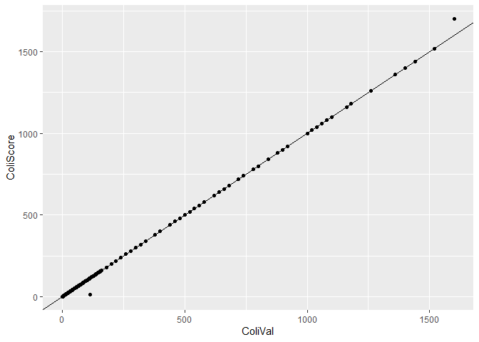
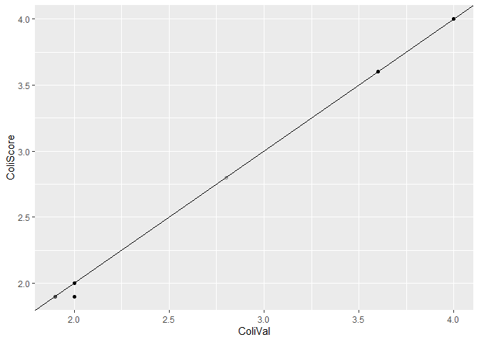
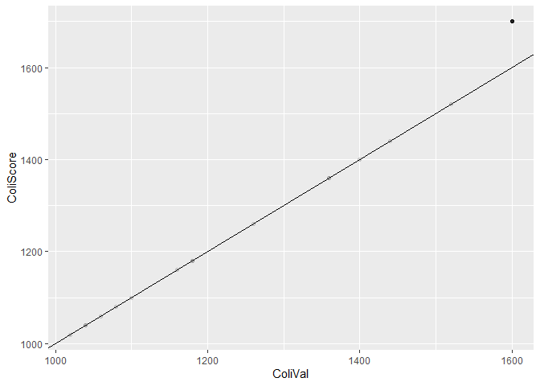

Shellfish Sanitation Program Data Assembly
================
Curtis C. Bohlen, Casco Bay Estuary Partnership.
11/14/2020

-   [Introduction](#introduction)
-   [Install Libraries](#install-libraries)
-   [Load Data](#load-data)
    -   [Folder References](#folder-references)
    -   [Read Data](#read-data)
    -   [Convert Orders of Factors](#convert-orders-of-factors)
    -   [What levels are present?](#what-levels-are-present)
    -   [Reorder Some](#reorder-some)
    -   [Simplify Column Names](#simplify-column-names)
    -   [Remove Unreliable / Uninformative
        Categories](#remove-unreliable--uninformative-categories)
-   [Consistency of How Censored Data is
    Reported](#consistency-of-how-censored-data-is-reported)
    -   [Left Censoring](#left-censoring)
-   [Right Censoring](#right-censoring)


# Introduction

Initial loading of the raw observational data uncovered what appear to
be data format inconsistencies with the way the E. coli data were
recorded. Here we explore the data inconsistencies and make decisions
regarding how to address them.

# Install Libraries

``` r
library(readr)
library(tidyverse)
```

    ## Warning: package 'tidyverse' was built under R version 4.0.5

    ## -- Attaching packages --------------------------------------- tidyverse 1.3.1 --

    ## v ggplot2 3.3.3     v dplyr   1.0.6
    ## v tibble  3.1.2     v stringr 1.4.0
    ## v tidyr   1.1.3     v forcats 0.5.1
    ## v purrr   0.3.4

    ## Warning: package 'tidyr' was built under R version 4.0.5

    ## Warning: package 'dplyr' was built under R version 4.0.5

    ## Warning: package 'forcats' was built under R version 4.0.5

    ## -- Conflicts ------------------------------------------ tidyverse_conflicts() --
    ## x dplyr::filter() masks stats::filter()
    ## x dplyr::lag()    masks stats::lag()

# Load Data

## Folder References

``` r
sibfldnm <- 'Original_Data'
parent <- dirname(getwd())
sibling <- file.path(parent,sibfldnm)
fn<- "Casco Bay WQ 15.19.csv"
```

## Read Data

Most of this code is to skip data columns that were used for data QA/QC,
or to ensure dates and times are properly interpreted.

``` r
path <- file.path(sibling, fn)
raw_data <- read_csv(path, 
    col_types = cols(
        ADVERSITY = col_skip(),  
        CATCH_COMMENTS = col_skip(), 
        CATCH_SEQ_NO = col_skip(),
        CATCH_UPDATE_DATE = col_skip(), 
        CATCH_UPDATE_USER = col_skip(),
        COL_METHOD = col_skip(), 
        DMR_CATCH_IDENTIFIER = col_skip(), 
        DMR_EFFORT_IDENTIFIER = col_skip(), 
        DMR_SAMPLE_IDENTIFIER = col_skip(), 
        EFFORT_COMMENTS = col_skip(),
        EFFORT_SEQ_NO = col_skip(), 
        EFFORT_START_DATE = col_date(format = "%Y-%m-%d"), 
        EFFORT_START_TIME = col_time(format = "%H:%M"), 
        EFFORT_UPDATE_DATE = col_skip(), 
        EFFORT_UPDATE_USER = col_skip(), 
        EXAM_DATE_TIME = col_skip(),
        INITIATED_BY = col_skip(), 
        INITIATED_DATE = col_skip(),
        LAB = col_skip(), 
        LAT_DD = col_skip(),
        LON_DD = col_skip(), 
        MISSED_STATION_CODE = col_skip(),
        ROW_NUMBER = col_skip(),
        SAMPLE_COMMENTS = col_skip(),
        SAMPLE_METHOD = col_skip(),
        SAMPLE_SEQ_NO = col_skip(), 
        SAMPLE_UPDATE_DATE = col_skip(), 
        SAMPLE_UPDATE_USER = col_skip(),
        STRATEGY = col_skip(),  
        TRIP_SEQ_NO = col_skip(),
        X = col_skip(),
        X1 = col_skip())) %>%
  mutate_at(c('LOCATION_ID', 'GROWING_AREA', 'OPEN_CLOSED_FLAG',
              'WIND_DIRECTION','TIDE_STAGE',
              'CURRENT_CLASSIFICATION_CODE',
              'CATEGORY'), factor) %>%
  mutate(YEAR = as.numeric(format(EFFORT_START_DATE, "%Y"))) %>%
  mutate(DOY = as.numeric(format(EFFORT_START_DATE, '%j'))) %>%
  mutate(MONTH = as.numeric(format(EFFORT_START_DATE, '%m')))
```

    ## Warning: Missing column names filled in: 'X1' [1]

``` r
with(raw_data, xtabs(~factor(format(EFFORT_START_DATE, '%m')) +factor(YEAR)))
```

    ##                                        factor(YEAR)
    ## factor(format(EFFORT_START_DATE, "%m")) 2015 2016 2017 2018 2019
    ##                                      01   69   55   72   89   71
    ##                                      02  128   52   50  116   68
    ##                                      03   73  165   94   68  125
    ##                                      04  356  225  188  265  200
    ##                                      05  204  224  246  246  196
    ##                                      06  230  260  244  219  221
    ##                                      07  218  117  208  137  260
    ##                                      08  163  284  277  287  257
    ##                                      09  179  133  227  205  207
    ##                                      10  219  169  110  207  171
    ##                                      11  150  252  214  109   78
    ##                                      12  210  108  119   36    0

Note that we the data sent to us does includes fewer November and no
December observations in 2019. We may be better off restricting our
analysis to 2015-2018. Although we can check for seasonal patterns in
the data as a check on the necessity for that.

## Convert Orders of Factors

Since these are factors, and not ordered factors, this is merely to make
it a bit easier to interpret results.It also has the effect of changing
the base category for contrasts. Note that this will not affect ordering
of factors when data is loaded in from CSV files, so this code (or
something very like it) will have to be run in any data analysis
scripts.

## What levels are present?

``` r
with(raw_data, levels(OPEN_CLOSED_FLAG))
```

    ## [1] "C" "O" "X"

``` r
with(raw_data, levels(WIND_DIRECTION))
```

    ##  [1] "CL"  "E"   "N"   "NE"  "NNE" "NW"  "S"   "SE"  "SW"  "W"

``` r
with(raw_data, levels(TIDE_STAGE))
```

    ## [1] "E"  "F"  "H"  "HE" "HF" "L"  "LE" "LF"

``` r
with(raw_data, levels(CURRENT_CLASSIFICATION_CODE))
```

    ## [1] "A"  "CA" "CR" "P"  "R"  "X"

``` r
with(raw_data, levels(CATEGORY))
```

    ## [1] "A" "I" "Z"

## Reorder Some

``` r
raw_data <- raw_data %>%
  mutate(WIND_DIRECTION =factor(WIND_DIRECTION,
                                levels = c("CL", "N", "NNE", "NE",
                                           "E","SE", "S","SW",
                                           "W", "NW"))) %>%
  mutate(CURRENT_CLASSIFICATION_CODE = factor(CURRENT_CLASSIFICATION_CODE,
                                              levels = c( 'A', 'CA', 'CR',
                                                          'R', 'P', 'X' ))) %>%
  mutate(TIDE_STAGE = factor(TIDE_STAGE, levels = c("L", "LF", "F", "HF",
                                                    "H", "HE", "E", "LE")))
```

## Simplify Column Names

Data names from DMR are long, in all caps, and awkward, so we want to
simplify. While we are at it, we want names to more or less match what
we found in the p90 files.

``` r
names(raw_data)
```

    ##  [1] "EFFORT_START_DATE"           "EFFORT_START_TIME"          
    ##  [3] "START_DATE_TIME"             "LOCATION_ID"                
    ##  [5] "GROWING_AREA"                "OPEN_CLOSED_FLAG"           
    ##  [7] "WIND_DIRECTION"              "TIDE_STAGE"                 
    ##  [9] "CURRENT_CLASSIFICATION_CODE" "CATEGORY"                   
    ## [11] "TEMP_C"                      "FLOOD"                      
    ## [13] "SALINITY_PCT"                "COL_SCORE"                  
    ## [15] "RAW_COL_SCORE"               "DELIVERY_TEMP_C"            
    ## [17] "YEAR"                        "DOY"                        
    ## [19] "MONTH"

``` r
raw_data <- raw_data %>%
  select(-FLOOD, -DELIVERY_TEMP_C) %>%
  rename(SDate = EFFORT_START_DATE,
         STime = EFFORT_START_TIME,
         SDateTime = START_DATE_TIME,
         Station =  LOCATION_ID,
         GROW_AREA =  GROWING_AREA,
         OpenClosed = OPEN_CLOSED_FLAG,
         WDIR = WIND_DIRECTION,
         Tide =  TIDE_STAGE,
         Class = CURRENT_CLASSIFICATION_CODE,
         Temp = TEMP_C,
         Sal = SALINITY_PCT,
         ColiScore = COL_SCORE,    # This value uses inappropriate substitution based on right censored values.
         RawColi = RAW_COL_SCORE)
```

``` r
with(raw_data, sum(OpenClosed=='X', na.rm=TRUE))
```

    ## [1] 38

``` r
with(raw_data, xtabs(~OpenClosed+factor(YEAR)))
```

    ##           factor(YEAR)
    ## OpenClosed 2015 2016 2017 2018 2019
    ##          C  599  534  584  461  392
    ##          O 1472 1369 1309 1393 1364
    ##          X    0    0    0    1   37

So, the “X” flag was not used prior to 2018, and used infrequently in
2019. We need to understand what that flag means, but it may be
appropriate for some analyses to delete records with the X flag….

``` r
with(raw_data, levels(WDIR))
```

    ##  [1] "CL"  "N"   "NNE" "NE"  "E"   "SE"  "S"   "SW"  "W"   "NW"

``` r
with(raw_data, xtabs(~WDIR+factor(YEAR)))
```

    ##      factor(YEAR)
    ## WDIR  2015 2016 2017 2018 2019
    ##   CL   865  758  859  740    0
    ##   N    236  267   93  142    0
    ##   NNE    0   10    0    0    0
    ##   NE    42   72   57   40    0
    ##   E     79   67   42   71    0
    ##   SE   115   34  114   83    0
    ##   S    135  220  288  321    0
    ##   SW   302  249  207  134    0
    ##   W     78  140   85   43    0
    ##   NW    89  173  157   65   28

Only “NW” was recorded in 2019. Most 2019 observations have no wind
direction code. NNE was only used in 2016. Otherwoise, these data look
inconsistent year to year, so they may not be all that useful for
analysis.

``` r
with(raw_data, xtabs(~OpenClosed+CATEGORY))
```

    ##           CATEGORY
    ## OpenClosed    A    I    Z
    ##          C 2569    1    0
    ##          O 6906    0    1
    ##          X    0    0   38

So CATEGORY contains no useful information for us.

``` r
with(raw_data, xtabs(~OpenClosed+Class))
```

    ##           Class
    ## OpenClosed    A   CA   CR    R    P    X
    ##          C  310 1068    1    9 1182    0
    ##          O 3695 2314  105  792    0    1
    ##          X    0    0    0    0    0   38

Note that there’s a (nearly) one to one match between category = Z,
OPenClosed=X and Class= X. Also note that Category = I was only used
once.

We’d like to know what the meaning of the OpenClosed flag really is. Was
this a flag showing condition before the sample, or a classification due
to the results of the sample. We should be able to determine that based
on the data itself.

## Remove Unreliable / Uninformative Categories

This code removes uninformative or inconsistent data and replaces “X”
values with NA.

``` r
raw_data<-raw_data %>%
  select(-CATEGORY, -WDIR) %>%
  mutate(Class = factor(Class,levels = c( 'A', 'CA', 'CR',
                                          'R', 'P'))) %>%
  mutate(OpenClosed = factor(OpenClosed, levels = c('O', 'C')))
```

# Consistency of How Censored Data is Reported

``` r
the_data <- raw_data %>%
  # Remove records with NAs for hte RawColi scores
  filter (! is.na(RawColi)) %>%
  #Identify censored data
  mutate(LCFlag = substr(RawColi,1,1)=='<') %>%
  mutate(RCFlag = substr(RawColi,1,1)=='>') %>%
  mutate(ColiVal = if_else(LCFlag,
                           substr(RawColi,2,nchar(RawColi)),
                           RawColi )) %>%
  mutate(ColiVal = if_else(RCFlag,
                           substr(RawColi,2,nchar(RawColi)),
                           ColiVal)) %>%
  mutate(ColiVal = as.numeric(ColiVal))
```

``` r
ggplot(the_data, aes(ColiVal, ColiScore)) +
  geom_point() +
  geom_abline(slope = 1, intercept = 0)
```

<!-- -->

So, here we see a couple of things:

1.  DMR replaced “raw” observations with arbitrary larger or smaller
    values when they produced the `"`ColiScore\` values. We may be able
    to do better, or handle these censored data with more
    sophistication.

2.  There’s a strange observation or group of observations that was
    recorded as &lt; something that is well above the nominal detection
    limits.

## Left Censoring

``` r
ggplot(the_data[the_data$ColiScore<5,], aes(ColiVal, ColiScore)) +
  geom_point(alpha = 0.1) +
  geom_abline(slope = 1, intercept = 0)
```

<!-- -->
So we have some inconsistency of how censored observations at the low
end were handled. DMR USUALLY recorded their `COL_SCORE` as 1.9,
presumably because that is “slightly below 2.0”, which is the true
reporting limit for the method. But a few times, DMR also reports the
‘RAW\_COL\_SCORE’ as “1.9”, instead of “&lt;2.”

``` r
the_data %>%
filter(ColiScore<2) %>%
  filter(RawColi != '<2') %>%
  select(SDate, ColiScore, RawColi, ColiVal, LCFlag)
```

    ## # A tibble: 7 x 5
    ##   SDate      ColiScore RawColi ColiVal LCFlag
    ##   <date>         <dbl> <chr>     <dbl> <lgl> 
    ## 1 2016-02-23       1.9 1.9         1.9 FALSE 
    ## 2 2016-02-23       1.9 1.9         1.9 FALSE 
    ## 3 2016-02-23       1.9 1.9         1.9 FALSE 
    ## 4 2016-02-23       1.9 1.9         1.9 FALSE 
    ## 5 2016-02-23       1.9 1.9         1.9 FALSE 
    ## 6 2016-02-23       1.9 1.9         1.9 FALSE 
    ## 7 2016-11-28       1.9 1.9         1.9 FALSE

Those anomalous entries come almost entirely from one day. Our guess is
that the detection limit for the method used does not vary, and so,
these observations were incorrectly recorded. Luckily, the apparent
inconsistencies are very rare, and can be adjusted with little concern
for loss of accuracy.

``` r
the_data$ColiVal[the_data$ColiVal==1.9 ] = 2.0
```

What about other inconsistencies, with regard to what values are flagged
as left censored?

``` r
the_data %>%
  filter(LCFlag) %>%
  group_by(ColiVal) %>%
  summarise(L = first(ColiVal)) %>%
  pull(L) 
```

    ## [1]  2 18

``` r
the_data[the_data$ColiVal==18 & the_data$LCFlag, ] %>%
  select(SDate, ColiScore, RawColi, ColiVal, LCFlag)
```

    ## # A tibble: 3 x 5
    ##   SDate      ColiScore RawColi ColiVal LCFlag
    ##   <date>         <dbl> <chr>     <dbl> <lgl> 
    ## 1 2015-05-04      17.9 <18          18 TRUE  
    ## 2 2015-05-04      17.9 <18          18 TRUE  
    ## 3 2015-05-04      17.9 <18          18 TRUE

DMR recorded three samples as left censored, with a reporting limit of
18. The observations were all from a single day. This elevated detection
limit is problematic, as it cold bias any unsophisticated handling of
non-detects.

We could consider removing these observations as anomalies, but there is
no internal justification for doing so. For now, we leave them in place.

# Right Censoring

``` r
ggplot(the_data[the_data$ColiScore>1000,], aes(ColiVal, ColiScore)) +
  geom_point(alpha = 0.1) +
  geom_abline(slope = 1, intercept = 0)
```

<!-- -->

``` r
the_data %>%
filter(ColiScore>1500) %>%
  select(ColiScore, RawColi, ColiVal, RCFlag)
```

    ## # A tibble: 19 x 4
    ##    ColiScore RawColi ColiVal RCFlag
    ##        <dbl> <chr>     <dbl> <lgl> 
    ##  1      1520 1520       1520 FALSE 
    ##  2      1700 >1600      1600 TRUE  
    ##  3      1700 >1600      1600 TRUE  
    ##  4      1700 >1600      1600 TRUE  
    ##  5      1700 >1600      1600 TRUE  
    ##  6      1700 >1600      1600 TRUE  
    ##  7      1700 >1600      1600 TRUE  
    ##  8      1700 >1600      1600 TRUE  
    ##  9      1700 >1600      1600 TRUE  
    ## 10      1700 >1600      1600 TRUE  
    ## 11      1700 >1600      1600 TRUE  
    ## 12      1700 >1600      1600 TRUE  
    ## 13      1700 >1600      1600 TRUE  
    ## 14      1700 >1600      1600 TRUE  
    ## 15      1700 >1600      1600 TRUE  
    ## 16      1700 >1600      1600 TRUE  
    ## 17      1700 >1600      1600 TRUE  
    ## 18      1700 >1600      1600 TRUE  
    ## 19      1700 >1600      1600 TRUE

So, DMR used an arbitrary value of 1700 as being “slightly” higher than
the 1600 upper detection limit.
